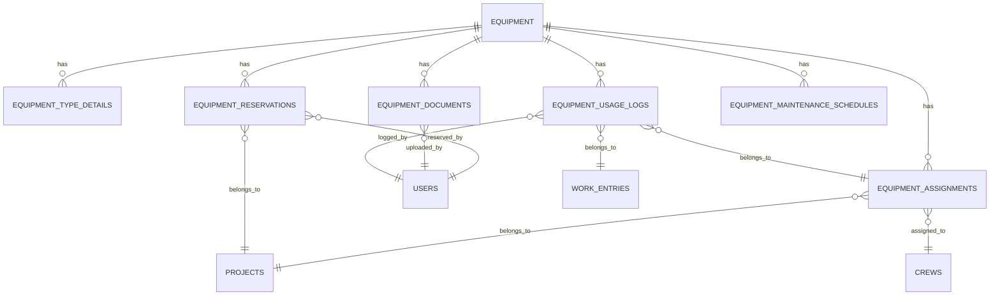

# Equipment Module - Comprehensive Analysis & Testing Plan

**Date**: 2025-10-29
**Project**: COMETA - Fiber Optic Construction Management System
**Module**: Equipment Management
**Analysis Type**: Architecture, API, Database, State Management, Testing Strategy

---

## Table of Contents

1. [Executive Summary](#executive-summary)
2. [Architecture Analysis](#architecture-analysis)
3. [Database Schema Analysis](#database-schema-analysis)
4. [API Inventory & Validation](#api-inventory--validation)
5. [State Management Analysis](#state-management-analysis)
6. [Component Structure Analysis](#component-structure-analysis)
7. [Testing Strategy](#testing-strategy)
8. [Code Quality Findings](#code-quality-findings)
9. [Implementation Plan](#implementation-plan)
10. [Risk Assessment](#risk-assessment)

---

## 1. Executive Summary

### Module Overview
The Equipment Management module is a **large and complex** feature with **1,725+ lines of API code** across 12 API endpoints, comprehensive database schemas with 7 migrations, advanced features including reservations, documents, usage tracking, and typed equipment views.

### Key Metrics
- **API Routes**: 12 endpoints (~1,725 LOC)
- **Database Tables**: 7 tables (equipment, equipment_reservations, equipment_documents, equipment_usage_logs, equipment_maintenance_schedules, equipment_type_details, equipment_assignments)
- **Database Views**: 4 typed views (power_tools, fusion_splicers, otdrs, safety_gear)
- **Custom Hooks**: 10+ hooks for state management
- **Components**: 11 dedicated components (typed tables, tabs, category-specific fields)
- **Pages**: 3 main pages (list, new, edit)
- **TypeScript Types**: 642 lines of enhanced types

### Current Status
✅ **Strengths**:
- Well-structured database schema with proper constraints
- Comprehensive TypeScript types
- Modern TanStack Query for state management
- Category-specific typed views for specialized equipment
- Advanced features (reservations, documents, usage logs, maintenance schedules)
- Direct Supabase integration (no FastAPI dependency)

⚠️ **Areas for Improvement**:
- **NO TEST COVERAGE** - Critical gap
- No input validation with Zod schemas in some API routes
- Inconsistent error handling patterns
- Missing API documentation
- No E2E test coverage for complex workflows
- Potential performance issues with large datasets

---

## 2. Architecture Analysis

### 2.1 File Structure

```
Equipment Module Structure
├── Frontend Pages (3 files)
│   ├── /dashboard/equipment/page.tsx (1,151 LOC)
│   ├── /dashboard/equipment/new/page.tsx
│   └── /dashboard/equipment/[id]/edit/page.tsx
│
├── API Routes (12 endpoints, ~1,725 LOC)
│   ├── /api/equipment/route.ts (GET, POST)
│   ├── /api/equipment/[id]/route.ts (GET, PUT, DELETE)
│   ├── /api/equipment/analytics/route.ts (GET)
│   ├── /api/equipment/reservations/route.ts (GET, POST)
│   ├── /api/equipment/reservations/[id]/route.ts (GET, PUT, DELETE)
│   ├── /api/equipment/documents/route.ts (GET, POST, PUT)
│   ├── /api/equipment/documents/[id]/route.ts (GET, PUT, DELETE)
│   ├── /api/equipment/usage/route.ts (GET, POST)
│   ├── /api/equipment/maintenance-schedules/route.ts (GET, POST, PUT, DELETE)
│   └── /api/equipment/typed-views/[viewType]/route.ts (GET)
│
├── Components (11 components)
│   ├── equipment/typed-equipment-table.tsx
│   ├── equipment/reservations-tab.tsx
│   ├── equipment/documents-tab.tsx
│   ├── equipment/usage-tab.tsx
│   ├── equipment/category-specific-fields.tsx
│   └── equipment/fields/* (6 category-specific field components)
│
├── Hooks (10+ hooks)
│   ├── use-equipment.ts (549 LOC)
│   ├── use-equipment-reservations.ts
│   ├── use-equipment-documents.ts
│   ├── use-equipment-usage.ts
│   ├── use-maintenance-schedules.ts
│   └── use-typed-equipment-views.ts
│
├── Types (1 file)
│   └── types/equipment-enhanced.ts (642 LOC)
│
└── Database (7 migrations)
    ├── 001_create_equipment_reservations.sql
    ├── 002_create_equipment_documents.sql
    ├── 003_create_equipment_usage_logs.sql
    ├── 004_create_equipment_maintenance_schedules.sql
    ├── 005_create_equipment_type_details.sql
    ├── 006_add_equipment_indexes_and_search.sql
    └── 007_add_equipment_category_indexes.sql
```

### 2.2 Data Flow Architecture

```
Frontend → API Routes → Supabase PostgreSQL
   ↓           ↓              ↓
TanStack    Validation    Database
  Query    + Business     Constraints
           Logic         + Triggers
```

**Key Characteristics**:
1. **Pure Supabase Architecture**: Direct PostgreSQL queries (no FastAPI microservices)
2. **Modern React Patterns**: TanStack Query for server state, optimistic updates
3. **Type-Safe**: Full TypeScript coverage from database to UI
4. **Modular**: Separation of concerns (hooks, components, API routes)

### 2.3 Feature Breakdown

#### Core Features
1. **Equipment CRUD Operations**
   - List equipment with filters (type, category, status, ownership, search)
   - Create new equipment with category-specific fields
   - Update equipment details
   - Soft delete equipment (is_active flag)
   - Category-based filtering (power_tool, fusion_splicer, otdr, safety_gear, measuring_device, accessory)

2. **Equipment Assignments**
   - Assign equipment to crews (crew-based logic)
   - Optional project association
   - Time-based assignments (from_ts, to_ts)
   - Permanent assignments support
   - Active assignment tracking

3. **Equipment Reservations**
   - Time-based reservations
   - Conflict detection (overlap prevention)
   - Project and user association
   - PostgreSQL GIST index for efficient conflict checking

4. **Equipment Documents**
   - Document upload to Supabase Storage
   - Document types: warranty, manual, calibration, inspection, safety, purchase, other
   - Expiry date tracking
   - Expiring documents alerts (< 60 days)
   - Document versioning support

5. **Equipment Usage Logs**
   - Daily usage tracking (hours)
   - Assignment and work entry association
   - Usage summary analytics
   - CSV import functionality

6. **Maintenance Schedules**
   - Calendar-based maintenance (every X days)
   - Usage-based maintenance (every X hours)
   - Cycle-based maintenance (every X cycles)
   - Overdue maintenance tracking
   - Upcoming maintenance alerts

7. **Typed Equipment Views**
   - Category-specific database views
   - Flat technical data (no JSON parsing needed)
   - Computed compliance status fields
   - Specialized columns per equipment category

8. **Analytics & Reporting**
   - Total usage hours
   - Efficiency score
   - Downtime rate
   - Revenue generation
   - Status distribution
   - Utilization by equipment type

---

## 3. Database Schema Analysis

### 3.1 Core Tables

#### 3.1.1 `equipment` (Main Table)

```sql
CREATE TABLE equipment (
  id UUID PRIMARY KEY DEFAULT gen_random_uuid(),
  type VARCHAR(100),                    -- Legacy field (machine, tool, measuring_device)
  category VARCHAR(50),                 -- NEW: power_tool, fusion_splicer, otdr, safety_gear, etc.
  name VARCHAR(255) NOT NULL,
  inventory_no VARCHAR(100) UNIQUE,
  serial_number VARCHAR(100),
  status VARCHAR(50) DEFAULT 'available', -- available, in_use, maintenance, broken, retired, lost
  description TEXT,
  notes TEXT,
  owned BOOLEAN DEFAULT true,
  current_location VARCHAR(255),
  purchase_date DATE,
  rental_cost_per_day NUMERIC(10, 2),
  supplier_name VARCHAR(255),
  warranty_until DATE,
  is_active BOOLEAN DEFAULT true,
  created_at TIMESTAMP DEFAULT NOW(),
  updated_at TIMESTAMP DEFAULT NOW()
);

-- Indexes
CREATE INDEX idx_equipment_category ON equipment(category) WHERE is_active = true;
CREATE INDEX idx_equipment_status ON equipment(status) WHERE is_active = true;
CREATE INDEX idx_equipment_owned ON equipment(owned) WHERE is_active = true;
CREATE INDEX idx_equipment_active ON equipment(is_active);
CREATE INDEX idx_equipment_search ON equipment USING gin(to_tsvector('simple', name || ' ' || COALESCE(inventory_no, '') || ' ' || COALESCE(description, '')));
```

**Relationships**:
- `equipment_type_details` (1:1) - Category-specific attributes
- `equipment_assignments` (1:N) - Assignment history
- `equipment_reservations` (1:N) - Reservation history
- `equipment_documents` (1:N) - Document storage
- `equipment_usage_logs` (1:N) - Usage tracking
- `equipment_maintenance_schedules` (1:N) - Maintenance scheduling

#### 3.1.2 `equipment_type_details` (Category-Specific Attributes)

```sql
CREATE TABLE equipment_type_details (
  id UUID PRIMARY KEY DEFAULT gen_random_uuid(),
  equipment_id UUID NOT NULL REFERENCES equipment(id) ON DELETE CASCADE UNIQUE,

  -- Power Tool attributes
  power_watts INTEGER CHECK (power_watts > 0),
  voltage_volts INTEGER CHECK (voltage_volts > 0),
  battery_type VARCHAR(50),
  battery_capacity_ah NUMERIC CHECK (battery_capacity_ah > 0),
  ip_rating VARCHAR(10),
  blade_size_mm INTEGER CHECK (blade_size_mm > 0),
  rpm INTEGER CHECK (rpm > 0),

  -- Fusion Splicer attributes
  brand VARCHAR(100),
  model VARCHAR(100),
  firmware_version VARCHAR(50),
  arc_calibration_date DATE,
  avg_splice_loss_db NUMERIC CHECK (avg_splice_loss_db >= 0),
  splice_count INTEGER DEFAULT 0 CHECK (splice_count >= 0),
  electrode_replacement_date DATE,

  -- OTDR attributes
  wavelength_nm INTEGER CHECK (wavelength_nm > 0),
  dynamic_range_db NUMERIC CHECK (dynamic_range_db > 0),
  fiber_type VARCHAR(50),
  connector_type VARCHAR(50),
  pulse_width_ns INTEGER CHECK (pulse_width_ns > 0),
  measurement_range_km NUMERIC CHECK (measurement_range_km > 0),

  -- Safety Gear attributes
  size VARCHAR(20),
  certification VARCHAR(100),
  inspection_due_date DATE,
  certification_expiry_date DATE,
  manufacturer VARCHAR(100),

  -- Measuring Equipment attributes
  accuracy_rating VARCHAR(50),
  measurement_unit VARCHAR(20),
  calibration_interval_months INTEGER CHECK (calibration_interval_months > 0),
  last_calibration_date DATE,
  calibration_certificate_no VARCHAR(100),

  -- Common attributes
  serial_number VARCHAR(100),
  purchase_price_eur NUMERIC CHECK (purchase_price_eur >= 0),
  depreciation_rate_percent NUMERIC CHECK (depreciation_rate_percent >= 0 AND depreciation_rate_percent <= 100),
  residual_value_eur NUMERIC CHECK (residual_value_eur >= 0),

  -- Flexible custom fields (JSONB)
  custom_attributes JSONB DEFAULT '{}',

  created_at TIMESTAMP DEFAULT NOW(),
  updated_at TIMESTAMP DEFAULT NOW()
);
```

**Design Pattern**: **Polymorphic Attributes**
- Single table for all equipment type-specific attributes
- NULL values for non-applicable fields
- JSONB `custom_attributes` for extensibility
- CHECK constraints for data validation

#### 3.1.3 `equipment_reservations` (Time-Based Reservations)

```sql
CREATE TABLE equipment_reservations (
  id UUID PRIMARY KEY DEFAULT gen_random_uuid(),
  equipment_id UUID NOT NULL REFERENCES equipment(id) ON DELETE CASCADE,
  project_id UUID REFERENCES projects(id) ON DELETE CASCADE,
  reserved_by_user_id UUID REFERENCES users(id) ON DELETE SET NULL,
  reserved_from TIMESTAMP NOT NULL,
  reserved_until TIMESTAMP NOT NULL,
  notes TEXT,
  is_active BOOLEAN DEFAULT true,
  created_at TIMESTAMP DEFAULT NOW(),
  updated_at TIMESTAMP DEFAULT NOW(),

  -- Validation
  CONSTRAINT check_reservation_dates CHECK (reserved_until > reserved_from),

  -- Prevent overlapping reservations (PostgreSQL GIST exclusion constraint)
  EXCLUDE USING gist (
    equipment_id WITH =,
    tsrange(reserved_from, reserved_until) WITH &&
  ) WHERE (is_active = true)
);
```

**Key Feature**: **Overlap Prevention** using PostgreSQL GIST index
- Ensures no two active reservations overlap for the same equipment
- Efficient conflict detection at database level
- Requires `btree_gist` extension

#### 3.1.4 `equipment_documents` (Document Management)

```sql
CREATE TABLE equipment_documents (
  id UUID PRIMARY KEY DEFAULT gen_random_uuid(),
  equipment_id UUID NOT NULL REFERENCES equipment(id) ON DELETE CASCADE,
  document_type VARCHAR(50) NOT NULL,  -- warranty, manual, calibration, inspection, safety, purchase, other
  document_name VARCHAR(255) NOT NULL,
  file_path VARCHAR(500) NOT NULL,     -- Supabase Storage path
  file_size_bytes BIGINT,
  mime_type VARCHAR(100),
  issue_date DATE,
  expiry_date DATE,
  notes TEXT,
  uploaded_by_user_id UUID REFERENCES users(id) ON DELETE SET NULL,
  is_active BOOLEAN DEFAULT true,
  created_at TIMESTAMP DEFAULT NOW(),
  updated_at TIMESTAMP DEFAULT NOW()
);

CREATE INDEX idx_equipment_documents_expiry ON equipment_documents(expiry_date) WHERE is_active = true AND expiry_date IS NOT NULL;
```

**Integration**: Supabase Storage bucket `project-documents` with `equipment/` prefix

#### 3.1.5 `equipment_usage_logs` (Usage Tracking)

```sql
CREATE TABLE equipment_usage_logs (
  id UUID PRIMARY KEY DEFAULT gen_random_uuid(),
  equipment_id UUID NOT NULL REFERENCES equipment(id) ON DELETE CASCADE,
  assignment_id UUID REFERENCES equipment_assignments(id) ON DELETE SET NULL,
  work_entry_id UUID REFERENCES work_entries(id) ON DELETE SET NULL,
  usage_date DATE NOT NULL,
  hours_used NUMERIC(5, 2) NOT NULL CHECK (hours_used >= 0 AND hours_used <= 24),
  notes TEXT,
  logged_by_user_id UUID REFERENCES users(id) ON DELETE SET NULL,
  created_at TIMESTAMP DEFAULT NOW()
);

CREATE INDEX idx_equipment_usage_logs_equipment_date ON equipment_usage_logs(equipment_id, usage_date DESC);
```

#### 3.1.6 `equipment_maintenance_schedules` (Maintenance Planning)

```sql
CREATE TABLE equipment_maintenance_schedules (
  id UUID PRIMARY KEY DEFAULT gen_random_uuid(),
  equipment_id UUID NOT NULL REFERENCES equipment(id) ON DELETE CASCADE,
  maintenance_type VARCHAR(50) NOT NULL,  -- routine, inspection, calibration, lubrication, cleaning, testing, other
  interval_type VARCHAR(20) NOT NULL,     -- calendar, usage_hours, cycles
  interval_value INTEGER NOT NULL CHECK (interval_value > 0),
  last_performed_date DATE,
  last_performed_hours INTEGER,
  next_due_date DATE,
  next_due_hours INTEGER,
  description TEXT,
  notes TEXT,
  is_active BOOLEAN DEFAULT true,
  created_at TIMESTAMP DEFAULT NOW(),
  updated_at TIMESTAMP DEFAULT NOW()
);

CREATE INDEX idx_equipment_maintenance_schedules_next_due ON equipment_maintenance_schedules(next_due_date) WHERE is_active = true AND next_due_date IS NOT NULL;
```

### 3.2 Database Views (Typed Equipment)

#### 3.2.1 `v_equipment_power_tools`

```sql
CREATE OR REPLACE VIEW v_equipment_power_tools AS
SELECT
  e.id,
  e.name,
  e.type,
  e.inventory_no,
  e.status,
  e.current_location,
  e.owned,
  e.rental_cost_per_day,
  etd.power_watts,
  etd.voltage_volts,
  etd.battery_type,
  etd.battery_capacity_ah,
  etd.ip_rating,
  etd.blade_size_mm,
  etd.rpm,
  etd.serial_number,
  etd.brand,
  etd.model
FROM equipment e
LEFT JOIN equipment_type_details etd ON etd.equipment_id = e.id
WHERE e.type ILIKE '%power%tool%' OR e.type ILIKE '%drill%' OR e.type ILIKE '%saw%'
  AND e.is_active = true;
```

**Purpose**: Flat table structure for UI rendering (no JOIN needed in application code)

#### 3.2.2 `v_equipment_fusion_splicers` (with Calibration Status)

```sql
CREATE OR REPLACE VIEW v_equipment_fusion_splicers AS
SELECT
  e.id,
  e.name,
  e.type,
  e.inventory_no,
  e.status,
  e.current_location,
  etd.brand,
  etd.model,
  etd.firmware_version,
  etd.arc_calibration_date,
  etd.avg_splice_loss_db,
  etd.splice_count,
  etd.electrode_replacement_date,
  etd.serial_number,
  CASE
    WHEN etd.arc_calibration_date IS NULL THEN 'never_calibrated'
    WHEN etd.arc_calibration_date < CURRENT_DATE - INTERVAL '6 months' THEN 'calibration_overdue'
    WHEN etd.arc_calibration_date < CURRENT_DATE - INTERVAL '5 months' THEN 'calibration_soon'
    ELSE 'calibration_ok'
  END AS calibration_status
FROM equipment e
LEFT JOIN equipment_type_details etd ON etd.equipment_id = e.id
WHERE e.type ILIKE '%fusion%splicer%' OR e.type ILIKE '%splicer%'
  AND e.is_active = true;
```

**Computed Field**: `calibration_status` based on last calibration date

#### 3.2.3 `v_equipment_otdrs` (with Calibration Status)

```sql
CREATE OR REPLACE VIEW v_equipment_otdrs AS
SELECT
  e.id,
  e.name,
  e.type,
  e.inventory_no,
  e.status,
  e.current_location,
  etd.brand,
  etd.model,
  etd.wavelength_nm,
  etd.dynamic_range_db,
  etd.fiber_type,
  etd.connector_type,
  etd.pulse_width_ns,
  etd.measurement_range_km,
  etd.last_calibration_date,
  etd.calibration_certificate_no,
  etd.serial_number,
  CASE
    WHEN etd.last_calibration_date IS NULL THEN 'never_calibrated'
    WHEN etd.last_calibration_date < CURRENT_DATE - INTERVAL '12 months' THEN 'calibration_overdue'
    WHEN etd.last_calibration_date < CURRENT_DATE - INTERVAL '10 months' THEN 'calibration_soon'
    ELSE 'calibration_ok'
  END AS calibration_status
FROM equipment e
LEFT JOIN equipment_type_details etd ON etd.equipment_id = e.id
WHERE e.type ILIKE '%otdr%' OR e.type ILIKE '%optical%time%domain%'
  AND e.is_active = true;
```

#### 3.2.4 `v_equipment_safety_gear` (with Compliance Status)

```sql
CREATE OR REPLACE VIEW v_equipment_safety_gear AS
SELECT
  e.id,
  e.name,
  e.type,
  e.inventory_no,
  e.status,
  e.current_location,
  etd.size,
  etd.certification,
  etd.inspection_due_date,
  etd.certification_expiry_date,
  etd.manufacturer,
  etd.serial_number,
  CASE
    WHEN etd.inspection_due_date IS NOT NULL AND etd.inspection_due_date < CURRENT_DATE THEN 'inspection_overdue'
    WHEN etd.inspection_due_date IS NOT NULL AND etd.inspection_due_date <= CURRENT_DATE + INTERVAL '30 days' THEN 'inspection_soon'
    WHEN etd.certification_expiry_date IS NOT NULL AND etd.certification_expiry_date < CURRENT_DATE THEN 'certification_expired'
    WHEN etd.certification_expiry_date IS NOT NULL AND etd.certification_expiry_date <= CURRENT_DATE + INTERVAL '60 days' THEN 'certification_expiring'
    ELSE 'ok'
  END AS compliance_status
FROM equipment e
LEFT JOIN equipment_type_details etd ON etd.equipment_id = e.id
WHERE e.type ILIKE '%safety%' OR e.type ILIKE '%ppe%' OR e.type ILIKE '%harness%'
  AND e.is_active = true;
```

**Computed Field**: `compliance_status` for safety compliance tracking

### 3.3 Database Functions

#### 3.3.1 `get_expiring_equipment_certifications(days_ahead INTEGER)`

```sql
CREATE OR REPLACE FUNCTION get_expiring_equipment_certifications(days_ahead INTEGER DEFAULT 60)
RETURNS TABLE (
  equipment_id UUID,
  equipment_name VARCHAR,
  equipment_type VARCHAR,
  cert_type VARCHAR,
  expiry_date DATE,
  days_until_expiry INTEGER
) AS $$
BEGIN
  RETURN QUERY
  -- Calibrations expiring
  SELECT e.id, e.name, e.type, 'calibration'::VARCHAR,
         (etd.last_calibration_date + INTERVAL '12 months')::DATE,
         ((etd.last_calibration_date + INTERVAL '12 months')::DATE - CURRENT_DATE)::INTEGER
  FROM equipment e
  JOIN equipment_type_details etd ON etd.equipment_id = e.id
  WHERE e.is_active = true AND etd.last_calibration_date IS NOT NULL
    AND (etd.last_calibration_date + INTERVAL '12 months')::DATE <= CURRENT_DATE + (days_ahead || ' days')::INTERVAL

  UNION ALL

  -- Certifications expiring
  SELECT e.id, e.name, e.type, 'certification'::VARCHAR,
         etd.certification_expiry_date,
         (etd.certification_expiry_date - CURRENT_DATE)::INTEGER
  FROM equipment e
  JOIN equipment_type_details etd ON etd.equipment_id = e.id
  WHERE e.is_active = true AND etd.certification_expiry_date IS NOT NULL
    AND etd.certification_expiry_date <= CURRENT_DATE + (days_ahead || ' days')::INTERVAL

  UNION ALL

  -- Inspections due
  SELECT e.id, e.name, e.type, 'inspection'::VARCHAR,
         etd.inspection_due_date,
         (etd.inspection_due_date - CURRENT_DATE)::INTEGER
  FROM equipment e
  JOIN equipment_type_details etd ON etd.equipment_id = e.id
  WHERE e.is_active = true AND etd.inspection_due_date IS NOT NULL
    AND etd.inspection_due_date <= CURRENT_DATE + (days_ahead || ' days')::INTERVAL

  ORDER BY days_until_expiry ASC;
END;
$$ LANGUAGE plpgsql;
```

**Usage**: `SELECT * FROM get_expiring_equipment_certifications(30);`

### 3.4 Database Schema Summary

| Table | Rows (Est.) | Purpose | Complexity |
|-------|-------------|---------|------------|
| `equipment` | 50-500 | Core equipment catalog | ⭐⭐ |
| `equipment_type_details` | 50-500 | Category-specific attributes | ⭐⭐⭐ |
| `equipment_assignments` | 500-5000 | Assignment history | ⭐⭐ |
| `equipment_reservations` | 100-1000 | Future reservations | ⭐⭐⭐ (GIST constraint) |
| `equipment_documents` | 200-2000 | Document metadata | ⭐⭐ |
| `equipment_usage_logs` | 1000-10000 | Daily usage logs | ⭐⭐ |
| `equipment_maintenance_schedules` | 50-500 | Maintenance planning | ⭐⭐ |

**Total Database Objects**: 7 tables, 4 views, 1 function, 20+ indexes

---

## 4. API Inventory & Validation

### 4.1 API Endpoint Summary

| Endpoint | Method | Purpose | LOC | Validation | Error Handling | Status |
|----------|--------|---------|-----|------------|----------------|--------|
| `/api/equipment` | GET | List equipment with filters | ~150 | ✅ Query params | ⚠️ Basic | ✅ Active |
| `/api/equipment` | POST | Create new equipment | ~143 | ✅ Zod schema | ✅ Rollback on failure | ✅ Active |
| `/api/equipment/[id]` | GET | Get single equipment | ~133 | ✅ ID param | ✅ 404 handling | ✅ Active |
| `/api/equipment/[id]` | PUT | Update equipment | ~88 | ⚠️ Partial | ⚠️ Basic | ✅ Active |
| `/api/equipment/[id]` | DELETE | Soft delete equipment | ~86 | ✅ Assignment check | ✅ Business logic | ✅ Active |
| `/api/equipment/analytics` | GET | Usage analytics | ~200 | ❌ None | ⚠️ Basic | ✅ Active |
| `/api/equipment/reservations` | GET | List reservations | ~134 | ✅ Query params | ✅ Good | ✅ Active |
| `/api/equipment/reservations` | POST | Create reservation | ~171 | ✅ Date validation | ✅ Conflict detection | ✅ Active |
| `/api/equipment/reservations/[id]` | GET, PUT, DELETE | Manage reservation | ~150 | ✅ ID param | ✅ Good | ✅ Active |
| `/api/equipment/documents` | GET | List documents | ~149 | ✅ Query params | ✅ Good | ✅ Active |
| `/api/equipment/documents` | POST | Upload document | ~85 | ✅ File upload | ✅ Cleanup on error | ✅ Active |
| `/api/equipment/documents/[id]` | PUT, DELETE | Manage document | ~100 | ✅ ID param | ✅ Good | ✅ Active |
| `/api/equipment/usage` | GET, POST | Usage logs | ~150 | ⚠️ Partial | ⚠️ Basic | ✅ Active |
| `/api/equipment/maintenance-schedules` | GET, POST, PUT, DELETE | Maintenance | ~200 | ⚠️ Partial | ⚠️ Basic | ✅ Active |
| `/api/equipment/typed-views/[viewType]` | GET | Typed equipment views | ~120 | ✅ View type param | ✅ Good | ✅ Active |

**Total**: 12 endpoint groups, ~1,725 lines of code

### 4.2 API Patterns Analysis

#### 4.2.1 Consistent Patterns ✅

1. **Supabase Client Initialization**
```typescript
const supabase = createClient(
  process.env.NEXT_PUBLIC_SUPABASE_URL!,
  process.env.NEXT_PUBLIC_SUPABASE_ANON_KEY!
);
```

2. **Pagination Standard**
```typescript
const page = parseInt(searchParams.get('page') || '1');
const per_page = parseInt(searchParams.get('per_page') || '20');
const offset = (page - 1) * per_page;

// Apply to query
query = query.range(offset, offset + per_page - 1);

// Return format
return NextResponse.json({
  items: data || [],
  total: count || 0,
  page,
  per_page,
  total_pages: Math.ceil((count || 0) / per_page),
});
```

3. **Error Response Format**
```typescript
return NextResponse.json(
  { error: 'Human-readable error message' },
  { status: 400 | 404 | 409 | 500 }
);
```

#### 4.2.2 Inconsistent Patterns ⚠️

**Issue #1**: Mixed validation approaches
- Some routes use Zod schemas (`createEquipmentSchema`)
- Others use manual validation (`if (!field) return error`)
- No consistent validation middleware

**Recommendation**: Create standard Zod schemas for all request/response types

**Issue #2**: Error handling depth varies
- Some routes have detailed error messages
- Others have generic "Failed to..." messages
- Inconsistent status codes for similar errors

**Recommendation**: Create centralized error handling utility

**Issue #3**: Authentication/Authorization missing
```typescript
// TODO: implement proper auth
const reserved_by_user_id = body.reserved_by_user_id || null;
```

**Recommendation**: Implement NextAuth session validation middleware

### 4.3 API Endpoint Details

#### 4.3.1 `GET /api/equipment` (List Equipment)

**Purpose**: Fetch paginated equipment list with comprehensive filters

**Query Parameters**:
- `page` (integer, default: 1)
- `per_page` (integer, default: 20)
- `type` (string) - Legacy: machine, tool, measuring_device
- `category` (string) - NEW: power_tool, fusion_splicer, otdr, safety_gear, measuring_device, accessory, uncategorized
- `status` (string) - available, in_use, maintenance, broken, retired, lost
- `owned` (boolean) - Filter by ownership
- `search` (string) - Full-text search on name, inventory_no, description, notes, location

**Response**:
```typescript
{
  items: Equipment[],
  total: number,
  page: number,
  per_page: number,
  total_pages: number
}
```

**Special Logic**: For `status=available`, filters out equipment with active assignments

**Performance**: Uses GIN index for full-text search

#### 4.3.2 `POST /api/equipment` (Create Equipment)

**Request Body**:
```typescript
{
  name: string,                  // Required
  category: string,             // Required: power_tool, fusion_splicer, etc.
  inventory_no?: string,
  serial_number?: string,
  status?: string,              // Default: 'available'
  notes?: string,
  ownership: 'owned' | 'rented',  // Maps to owned boolean
  location?: string,
  purchase_date?: string,
  purchase_price?: number,
  manufacturer?: string,
  model?: string,
  type_details: {              // Category-specific fields
    // Power Tool
    power_watts?: number,
    voltage_volts?: number,
    battery_type?: string,
    // ... (many more category-specific fields)
  }
}
```

**Validation**: Uses Zod schema `createEquipmentSchema`

**Transaction Logic**:
1. Create `equipment` record
2. Create `equipment_type_details` record
3. Auto-compute calibration/inspection dates based on category
4. Rollback if step 2 fails

**Auto-Computation Example**:
```typescript
if (category === 'fusion_splicer' && type_details.last_calibration_date) {
  const intervalDays = type_details.maintenance_interval_days || 365;
  processedTypeDetails.next_calibration_due = computeNextCalibrationDate(
    type_details.last_calibration_date,
    intervalDays
  );
}
```

#### 4.3.3 `GET /api/equipment/[id]` (Get Equipment Details)

**Response**: Includes related data
```typescript
{
  id: string,
  type: string,
  category: string,
  name: string,
  inventory_no: string,
  owned: boolean,
  status: string,
  current_location: string,
  // ... more fields
  current_assignment: {
    id: string,
    project_id: string,
    crew_id: string,
    from_ts: string,
    to_ts: string | null,
    project: { id, name, city },
    crew: { id, name },
    duration_days: number | null
  } | null,
  assignments_count: number
}
```

**Special Logic**: Calculates current assignment from `equipment_assignments` array

#### 4.3.4 `DELETE /api/equipment/[id]` (Soft Delete)

**Business Logic**:
1. Check for active assignments (no `to_ts`)
2. If active assignments exist, return 400 error
3. Otherwise, set `is_active = false` (soft delete)

**Error Messages**: User-friendly
```typescript
if (activeAssignments && activeAssignments.length > 0) {
  return NextResponse.json(
    { error: 'Cannot delete equipment with active assignments. Please end all assignments first.' },
    { status: 400 }
  );
}
```

#### 4.3.5 `POST /api/equipment/reservations` (Create Reservation)

**Conflict Detection**: Three levels
1. **Database GIST Constraint** (primary)
   - PostgreSQL exclusion constraint prevents overlaps at INSERT
   - Most efficient, enforced at database level

2. **RPC Function** (if available)
   ```sql
   SELECT * FROM check_equipment_reservation_conflicts(
     p_equipment_id, p_reserved_from, p_reserved_until
   );
   ```

3. **Manual Overlap Check** (fallback)
   ```typescript
   const hasConflict = existingReservations?.some((res) => {
     const existingFrom = new Date(res.reserved_from);
     const existingUntil = new Date(res.reserved_until);
     return (
       (from >= existingFrom && from < existingUntil) ||
       (until > existingFrom && until <= existingUntil) ||
       (from <= existingFrom && until >= existingUntil)
     );
   });
   ```

**Error Response** (409 Conflict):
```typescript
{
  error: 'Reservation conflict',
  message: 'Equipment is already reserved from ... to ...',
  conflict: {
    project_name: string,
    reserved_by: string,
    from: string,
    until: string
  }
}
```

#### 4.3.6 `POST /api/equipment/documents` (Upload Document)

**File Upload Flow**:
1. Parse `multipart/form-data`
2. Validate required fields
3. Upload file to Supabase Storage
   - Bucket: `project-documents`
   - Path: `equipment/{equipment_id}/{timestamp}_{sanitized_filename}`
4. Create database record in `equipment_documents`
5. On failure, cleanup uploaded file

**Document Types**: warranty, manual, calibration, inspection, safety, purchase, other

**Expiry Tracking**:
- Documents with `expiry_date` are tracked
- `GET /api/equipment/documents?expiring_within_days=30` returns expiring docs
- Used for notifications and alerts

#### 4.3.7 `GET /api/equipment/typed-views/[viewType]` (Typed Equipment Views)

**View Types**:
- `power_tools` → `v_equipment_power_tools`
- `fusion_splicers` → `v_equipment_fusion_splicers`
- `otdrs` → `v_equipment_otdrs`
- `safety_gear` → `v_equipment_safety_gear`

**Purpose**: Fetch equipment with category-specific columns in flat structure

**Benefits**:
- No need to parse `type_details` JSON in frontend
- Computed status fields (calibration_status, compliance_status)
- Optimized queries (database views are pre-joined)

### 4.4 API Duplication Check

✅ **NO DUPLICATE API ROUTES FOUND**

All Equipment API routes are unique and serve distinct purposes. No legacy routes or duplicate endpoints detected.

### 4.5 API Documentation Status

❌ **NO FORMAL API DOCUMENTATION**

**Recommendations**:
1. Generate OpenAPI/Swagger documentation
2. Use Zod to OpenAPI converter
3. Document expected error responses
4. Add request/response examples

---

## 5. State Management Analysis

### 5.1 TanStack Query Hook Patterns

#### 5.1.1 `use-equipment.ts` (549 LOC)

**Query Hooks**:

```typescript
// List equipment with filters
export function useEquipment(filters?: EquipmentFilters) {
  return useQuery({
    queryKey: ['equipment', filters],
    queryFn: () => api.getEquipment(filters),
  });
}

// Get single equipment
export function useEquipmentItem(id: string) {
  return useQuery({
    queryKey: ['equipment', id],
    queryFn: () => api.getEquipmentItem(id),
    enabled: !!id,
  });
}

// Get typed equipment view (category-specific)
export function useTypedEquipmentView(category: string, filters?: TypedViewFilters) {
  const viewTypeMap: Record<string, ViewType> = {
    'power_tool': 'power_tools',
    'fusion_splicer': 'fusion_splicers',
    'otdr': 'otdrs',
    'safety_gear': 'safety_gear',
    'measuring_device': 'measuring_devices',
    'accessory': 'accessories',
  };

  const viewType = viewTypeMap[category];

  return useQuery({
    queryKey: ['equipment', 'typed-view', viewType, filters],
    queryFn: async () => {
      if (!viewType) {
        return { items: [], total: 0, page: 1, per_page: 20, total_pages: 0 };
      }
      const response = await fetch(`/api/equipment/typed-views/${viewType}?${params}`);
      return response.json();
    },
    enabled: !!viewType,
    staleTime: 30 * 1000, // 30 seconds
  });
}

// Equipment analytics
export function useEquipmentAnalytics() {
  return useQuery({
    queryKey: ['equipment-analytics'],
    queryFn: () => api.getAnalytics(),
    staleTime: 5 * 60 * 1000, // 5 minutes
  });
}
```

**Mutation Hooks**:

```typescript
// Create equipment
export function useCreateEquipment() {
  const queryClient = useQueryClient();

  return useMutation({
    mutationFn: api.createEquipment,
    onSuccess: () => {
      queryClient.invalidateQueries({ queryKey: ['equipment'] });
      toast.success('Equipment created successfully');
    },
    onError: (error: Error) => {
      toast.error(error.message);
    },
  });
}

// Update equipment
export function useUpdateEquipment() {
  const queryClient = useQueryClient();

  return useMutation({
    mutationFn: ({ id, data }: { id: string; data: Partial<Equipment> }) =>
      api.updateEquipment(id, data),
    onSuccess: (_, { id }) => {
      queryClient.invalidateQueries({ queryKey: ['equipment'] });
      queryClient.invalidateQueries({ queryKey: ['equipment', id] });
      toast.success('Equipment updated successfully');
    },
    onError: (error: Error) => {
      toast.error(error.message);
    },
  });
}

// Delete equipment
export function useDeleteEquipment() {
  const queryClient = useQueryClient();

  return useMutation({
    mutationFn: api.deleteEquipment,
    onSuccess: () => {
      queryClient.invalidateQueries({ queryKey: ['equipment'] });
      toast.success('Equipment deleted successfully');
    },
    onError: (error: Error) => {
      toast.error(error.message);
    },
  });
}
```

**Assignment Hooks**:

```typescript
// List equipment assignments (crew-based)
export function useEquipmentAssignments(filters?: AssignmentFilters) {
  return useQuery({
    queryKey: ['equipment-assignments', filters],
    queryFn: () => api.getAssignments(filters),
    staleTime: 30 * 1000, // 30 seconds - crew assignments change frequently
  });
}

// Create assignment
export function useCreateAssignment() {
  const queryClient = useQueryClient();

  return useMutation({
    mutationFn: api.createAssignment,
    onSuccess: (data) => {
      queryClient.invalidateQueries({ queryKey: ['equipment-assignments'] });
      queryClient.invalidateQueries({ queryKey: ['equipment'] });
      queryClient.invalidateQueries({ queryKey: ['crews'] }); // Cascade invalidation
      toast.success(data.message || 'Assignment created successfully');
    },
    onError: (error: Error) => {
      // Enhanced error handling for crew validation
      if (error.message.includes('Crew not found') || error.message.includes('CREW_NOT_FOUND')) {
        toast.error('Selected crew is not found or inactive. Please select a valid crew.');
      } else if (error.message.includes('crew_id') || error.message.includes('Crew ID')) {
        toast.error('Crew selection is required. Please select a crew for this assignment.');
      } else {
        toast.error(error.message);
      }
    },
  });
}
```

#### 5.1.2 `use-equipment-reservations.ts`

```typescript
// List reservations
export function useEquipmentReservations(filters?: EquipmentReservationFilters) {
  return useQuery({
    queryKey: ['equipment-reservations', filters],
    queryFn: () => api.getReservations(filters),
    staleTime: 60 * 1000, // 1 minute
  });
}

// Create reservation with conflict detection
export function useCreateReservation() {
  const queryClient = useQueryClient();

  return useMutation({
    mutationFn: api.createReservation,
    onSuccess: () => {
      queryClient.invalidateQueries({ queryKey: ['equipment-reservations'] });
      queryClient.invalidateQueries({ queryKey: ['equipment'] });
      toast.success('Reservation created successfully');
    },
    onError: (error: any) => {
      if (error.status === 409) {
        // Conflict - show detailed message
        toast.error(`Reservation conflict: ${error.message}`);
      } else {
        toast.error('Failed to create reservation');
      }
    },
  });
}
```

#### 5.1.3 `use-equipment-documents.ts`

```typescript
// List documents with expiry tracking
export function useEquipmentDocuments(filters?: EquipmentDocumentFilters) {
  return useQuery({
    queryKey: ['equipment-documents', filters],
    queryFn: () => api.getDocuments(filters),
    staleTime: 2 * 60 * 1000, // 2 minutes
  });
}

// Get expiring documents (for notifications)
export function useExpiringDocuments(days: number = 60) {
  return useQuery({
    queryKey: ['equipment-documents', 'expiring', days],
    queryFn: () => api.getDocuments({ expiring_within_days: days, active_only: true }),
    staleTime: 5 * 60 * 1000, // 5 minutes
  });
}

// Upload document (FormData)
export function useUploadEquipmentDocument() {
  const queryClient = useQueryClient();

  return useMutation({
    mutationFn: api.uploadDocument,
    onSuccess: () => {
      queryClient.invalidateQueries({ queryKey: ['equipment-documents'] });
      toast.success('Document uploaded successfully');
    },
    onError: (error: Error) => {
      toast.error(`Upload failed: ${error.message}`);
    },
  });
}
```

#### 5.1.4 `use-equipment-usage.ts`

```typescript
// List usage logs
export function useEquipmentUsageLogs(filters?: EquipmentUsageFilters) {
  return useQuery({
    queryKey: ['equipment-usage', filters],
    queryFn: () => api.getUsageLogs(filters),
    staleTime: 60 * 1000, // 1 minute
  });
}

// Get usage summary for equipment
export function useEquipmentUsageSummary(equipment_id: string, from_date?: string, to_date?: string) {
  return useQuery({
    queryKey: ['equipment-usage-summary', equipment_id, from_date, to_date],
    queryFn: () => api.getUsageSummary({ equipment_id, from_date, to_date }),
    enabled: !!equipment_id,
    staleTime: 5 * 60 * 1000, // 5 minutes
  });
}

// Log usage
export function useLogEquipmentUsage() {
  const queryClient = useQueryClient();

  return useMutation({
    mutationFn: api.logUsage,
    onSuccess: () => {
      queryClient.invalidateQueries({ queryKey: ['equipment-usage'] });
      queryClient.invalidateQueries({ queryKey: ['equipment-usage-summary'] });
      toast.success('Usage logged successfully');
    },
  });
}
```

#### 5.1.5 `use-maintenance-schedules.ts`

```typescript
// List maintenance schedules
export function useMaintenanceSchedules(filters?: MaintenanceScheduleFilters) {
  return useQuery({
    queryKey: ['equipment-maintenance-schedules', filters],
    queryFn: () => api.getSchedules(filters),
    staleTime: 2 * 60 * 1000, // 2 minutes
  });
}

// Get overdue maintenance count (for dashboard)
export function useOverdueMaintenanceCount() {
  const { data } = useMaintenanceSchedules({ overdue_only: true, active_only: true });
  return data?.total || 0;
}

// Get upcoming maintenance (next N days)
export function useUpcomingMaintenance(days: number = 30) {
  return useQuery({
    queryKey: ['equipment-maintenance', 'upcoming', days],
    queryFn: () => api.getSchedules({ upcoming_within_days: days, active_only: true }),
    staleTime: 5 * 60 * 1000, // 5 minutes
  });
}

// Create maintenance schedule
export function useCreateMaintenanceSchedule() {
  const queryClient = useQueryClient();

  return useMutation({
    mutationFn: api.createSchedule,
    onSuccess: () => {
      queryClient.invalidateQueries({ queryKey: ['equipment-maintenance-schedules'] });
      toast.success('Maintenance schedule created');
    },
  });
}
```

### 5.2 Cache Management Strategy

**Query Keys Hierarchy**:
```typescript
['equipment']                              // All equipment queries
['equipment', filters]                     // Filtered equipment list
['equipment', id]                          // Single equipment
['equipment', 'typed-view', viewType, filters]  // Typed views

['equipment-assignments']                  // All assignments
['equipment-assignments', filters]         // Filtered assignments
['equipment-assignments', 'crew', crew_id] // Crew-specific

['equipment-reservations']                 // All reservations
['equipment-reservations', filters]        // Filtered reservations

['equipment-documents']                    // All documents
['equipment-documents', filters]           // Filtered documents
['equipment-documents', 'expiring', days]  // Expiring documents

['equipment-usage']                        // All usage logs
['equipment-usage-summary', equipment_id]  // Usage summary

['equipment-maintenance-schedules']        // All maintenance
['equipment-maintenance', 'upcoming', days] // Upcoming maintenance

['equipment-analytics']                    // Analytics data
```

**Invalidation Strategy**:
- **Create Equipment** → Invalidate `['equipment']`
- **Update Equipment** → Invalidate `['equipment']` + `['equipment', id]`
- **Delete Equipment** → Invalidate `['equipment']`
- **Create Assignment** → Invalidate `['equipment-assignments']`, `['equipment']`, `['crews']`
- **Create Reservation** → Invalidate `['equipment-reservations']`, `['equipment']`
- **Upload Document** → Invalidate `['equipment-documents']`
- **Log Usage** → Invalidate `['equipment-usage']`, `['equipment-usage-summary']`

**Stale Time Configuration**:
- Equipment list: Default (no explicit staleTime) → 0 (always refetch)
- Equipment item: Default → 0
- Typed views: 30 seconds
- Assignments: 30 seconds (frequently changing)
- Reservations: 60 seconds
- Documents: 2 minutes
- Usage logs: 60 seconds
- Analytics: 5 minutes
- Maintenance schedules: 2 minutes

### 5.3 Optimistic Updates

❌ **NOT IMPLEMENTED**

**Current**: All mutations wait for server response before updating UI

**Recommendation**: Implement optimistic updates for better UX
```typescript
export function useUpdateEquipment() {
  const queryClient = useQueryClient();

  return useMutation({
    mutationFn: ({ id, data }: { id: string; data: Partial<Equipment> }) =>
      api.updateEquipment(id, data),
    onMutate: async ({ id, data }) => {
      // Cancel outgoing queries
      await queryClient.cancelQueries({ queryKey: ['equipment', id] });

      // Snapshot previous value
      const previous = queryClient.getQueryData(['equipment', id]);

      // Optimistically update
      queryClient.setQueryData(['equipment', id], (old: any) => ({
        ...old,
        ...data,
      }));

      return { previous };
    },
    onError: (err, variables, context) => {
      // Rollback on error
      if (context?.previous) {
        queryClient.setQueryData(['equipment', variables.id], context.previous);
      }
      toast.error(err.message);
    },
    onSuccess: (_, { id }) => {
      queryClient.invalidateQueries({ queryKey: ['equipment'] });
      queryClient.invalidateQueries({ queryKey: ['equipment', id] });
      toast.success('Equipment updated successfully');
    },
  });
}
```

### 5.4 Error Handling Analysis

**Current Approach**:
```typescript
onError: (error: Error) => {
  toast.error(error.message);
}
```

**Issues**:
- Generic error messages
- No error categorization
- No retry strategy
- No offline handling

**Recommendation**: Enhanced error handling
```typescript
interface APIError {
  status: number;
  code: string;
  message: string;
  details?: any;
}

function categorizeError(error: APIError): {
  category: 'network' | 'validation' | 'authorization' | 'conflict' | 'server';
  userMessage: string;
  shouldRetry: boolean;
} {
  if (!navigator.onLine) {
    return {
      category: 'network',
      userMessage: 'No internet connection. Please check your network.',
      shouldRetry: true,
    };
  }

  if (error.status >= 400 && error.status < 500) {
    return {
      category: error.status === 409 ? 'conflict' : 'validation',
      userMessage: error.message,
      shouldRetry: false,
    };
  }

  return {
    category: 'server',
    userMessage: 'Something went wrong. Please try again.',
    shouldRetry: true,
  };
}

// Usage in mutation
onError: (error: any) => {
  const { category, userMessage, shouldRetry } = categorizeError(error);

  if (category === 'conflict') {
    toast.error(userMessage, { duration: 6000 });
  } else if (shouldRetry) {
    toast.error(userMessage, {
      action: {
        label: 'Retry',
        onClick: () => mutation.mutate(variables),
      },
    });
  } else {
    toast.error(userMessage);
  }
}
```

---

## 6. Component Structure Analysis

### 6.1 Main Equipment Page

**File**: `src/app/(dashboard)/dashboard/equipment/page.tsx` (1,151 LOC)

**Complexity**: ⭐⭐⭐⭐ (Very High)

**Structure**:
```tsx
export default function EquipmentPage() {
  // State management (5 state variables)
  const [activeTab, setActiveTab] = useState("fleet");
  const [selectedCategory, setSelectedCategory] = useState<string>('all');
  const [filters, setFilters] = useState({ type, status, owned, search });

  // Data fetching (7 hooks)
  const { data: equipmentData } = useEquipment(filters);
  const { data: typedViewData } = useTypedEquipmentView(selectedCategory, filters);
  const { data: equipmentAssignments } = useEquipmentAssignments();
  const { data: analytics } = useEquipmentAnalytics();
  const overdueMaintenanceCount = useOverdueMaintenanceCount();
  const { data: expiringDocsData } = useExpiringDocuments(30);

  // Event handlers (6 functions)
  const handleFilterChange = (key, value) => { ... };
  const handleDeleteEquipment = async (id, name) => { ... };
  const handleEditAssignment = (id) => { ... };
  const handleCategoryChange = (category) => { ... };
  const handleDeleteAssignment = async (id, name) => { ... };

  // Computed values (2 calculations)
  const stats = equipment.reduce(...);
  const utilizationRate = Math.round((stats.inUse / stats.total) * 100);

  return (
    <div>
      {/* Statistics Cards (4 cards) */}
      {/* Tabs (6 tabs) */}
      <Tabs value={activeTab} onValueChange={setActiveTab}>
        <TabsContent value="fleet">
          {/* Filters Card */}
          {/* Category Tabs (8 categories) */}
          {/* Equipment Table (conditional: typed view or all) */}
        </TabsContent>
        <TabsContent value="assignments">
          {/* Assignment Statistics (3 cards) */}
          {/* Assignments Table */}
        </TabsContent>
        <TabsContent value="usage">
          {/* Usage Statistics (4 cards) */}
          {/* Analytics Charts (3 charts) */}
        </TabsContent>
        <TabsContent value="reservations">
          <ReservationsTab />
        </TabsContent>
        <TabsContent value="documents">
          <DocumentsTab />
        </TabsContent>
        <TabsContent value="usage-logs">
          <UsageTab />
        </TabsContent>
      </Tabs>
    </div>
  );
}

// Chart Components (3 internal components)
const UsageChart = ({ data, loading }) => { ... };
const StatusPieChart = ({ data, loading }) => { ... };
const PerformanceChart = ({ data, loading }) => { ... };
```

**Issues**:
1. **Too Large**: 1,151 LOC violates Single Responsibility Principle
2. **Multiple Concerns**: Statistics, charts, tables, filters, tabs all in one file
3. **Difficult to Test**: Hard to isolate and test individual features
4. **Performance**: Re-renders entire component on any state change

**Recommendation**: Split into smaller components
```
equipment/
├── EquipmentPage.tsx (orchestration, < 200 LOC)
├── components/
│   ├── EquipmentStatistics.tsx
│   ├── EquipmentFilters.tsx
│   ├── EquipmentCategoryTabs.tsx
│   ├── EquipmentTable.tsx
│   ├── AssignmentsTab.tsx
│   ├── AnalyticsTab.tsx
│   ├── charts/
│   │   ├── UsageChart.tsx
│   │   ├── StatusPieChart.tsx
│   │   └── PerformanceChart.tsx
```

### 6.2 Typed Equipment Table Component

**File**: `src/components/equipment/typed-equipment-table.tsx`

**Purpose**: Render equipment table with category-specific columns

**Props**:
```typescript
interface TypedEquipmentTableProps {
  category: string;                    // power_tool, fusion_splicer, etc.
  equipment: Equipment[];
  onDelete: (id: string, name: string) => void;
}
```

**Column Configuration**:
```typescript
const categoryConfig = {
  power_tool: {
    label: 'Power Tools',
    columns: [
      { key: 'power_watts', label: 'Power (W)', type: 'number' },
      { key: 'voltage_volts', label: 'Voltage (V)', type: 'number' },
      { key: 'battery_type', label: 'Battery Type', type: 'text' },
      { key: 'rpm', label: 'RPM', type: 'number' },
    ],
  },
  fusion_splicer: {
    label: 'Fusion Splicers',
    columns: [
      { key: 'brand', label: 'Brand', type: 'text' },
      { key: 'model', label: 'Model', type: 'text' },
      { key: 'calibration_status', label: 'Calibration', type: 'status' },
      { key: 'splice_count', label: 'Splice Count', type: 'number' },
    ],
  },
  otdr: {
    label: 'OTDRs',
    columns: [
      { key: 'wavelength_nm', label: 'Wavelength (nm)', type: 'number' },
      { key: 'dynamic_range_db', label: 'Dynamic Range (dB)', type: 'number' },
      { key: 'fiber_type', label: 'Fiber Type', type: 'text' },
      { key: 'calibration_status', label: 'Calibration', type: 'status' },
    ],
  },
  safety_gear: {
    label: 'Safety Gear',
    columns: [
      { key: 'size', label: 'Size', type: 'text' },
      { key: 'certification', label: 'Certification', type: 'text' },
      { key: 'compliance_status', label: 'Compliance', type: 'status' },
      { key: 'inspection_due_date', label: 'Next Inspection', type: 'date' },
    ],
  },
};
```

**Rendering Logic**:
```tsx
<Table>
  <TableHeader>
    <TableRow>
      <TableHead>Name</TableHead>
      <TableHead>Inventory No</TableHead>
      <TableHead>Status</TableHead>
      {config.columns.map(col => (
        <TableHead key={col.key}>{col.label}</TableHead>
      ))}
      <TableHead>Actions</TableHead>
    </TableRow>
  </TableHeader>
  <TableBody>
    {equipment.map(item => (
      <TableRow key={item.id}>
        <TableCell>{item.name}</TableCell>
        <TableCell>{item.inventory_no}</TableCell>
        <TableCell><StatusBadge status={item.status} /></TableCell>
        {config.columns.map(col => (
          <TableCell key={col.key}>
            {renderCell(item, col)}
          </TableCell>
        ))}
        <TableCell>
          <Button onClick={() => router.push(`/equipment/${item.id}/edit`)}>
            <Edit />
          </Button>
          <Button onClick={() => onDelete(item.id, item.name)}>
            <Trash2 />
          </Button>
        </TableCell>
      </TableRow>
    ))}
  </TableBody>
</Table>
```

**Strengths**:
- Dynamic column rendering based on category
- Type-safe with TypeScript
- Reusable configuration

**Issues**:
- No virtualization for large datasets
- No column sorting/filtering
- No column resizing

### 6.3 Category-Specific Field Components

**Pattern**: One component per equipment category

**Files**:
- `equipment/fields/power-tool-fields.tsx`
- `equipment/fields/fusion-splicer-fields.tsx`
- `equipment/fields/otdr-fields.tsx`
- `equipment/fields/safety-gear-fields.tsx`
- `equipment/fields/measuring-device-fields.tsx`
- `equipment/fields/accessory-fields.tsx`

**Example**: `power-tool-fields.tsx`
```tsx
interface PowerToolFieldsProps {
  form: UseFormReturn<EquipmentFormData>;
}

export function PowerToolFields({ form }: PowerToolFieldsProps) {
  return (
    <>
      <FormField
        control={form.control}
        name="type_details.power_watts"
        render={({ field }) => (
          <FormItem>
            <FormLabel>Power (Watts)</FormLabel>
            <FormControl>
              <Input type="number" placeholder="1000" {...field} />
            </FormControl>
            <FormMessage />
          </FormItem>
        )}
      />

      <FormField
        control={form.control}
        name="type_details.voltage_volts"
        render={({ field }) => (
          <FormItem>
            <FormLabel>Voltage (Volts)</FormLabel>
            <FormControl>
              <Input type="number" placeholder="220" {...field} />
            </FormControl>
            <FormMessage />
          </FormItem>
        )}
      />

      <FormField
        control={form.control}
        name="type_details.battery_type"
        render={({ field }) => (
          <FormItem>
            <FormLabel>Battery Type</FormLabel>
            <FormControl>
              <Input placeholder="Li-Ion 18V" {...field} />
            </FormControl>
            <FormMessage />
          </FormItem>
        )}
      />

      {/* ... more fields ... */}
    </>
  );
}
```

**Strengths**:
- Clean separation of concerns
- Easy to add new equipment categories
- Form validation per field

**Issues**:
- No field-level documentation
- No tooltips/help text
- Repetitive FormField boilerplate

### 6.4 Tab Components

**Files**:
- `equipment/reservations-tab.tsx` - Equipment reservations management
- `equipment/documents-tab.tsx` - Document upload and expiry tracking
- `equipment/usage-tab.tsx` - Usage logs and analytics

**Pattern**: Self-contained feature tabs

**Example**: `reservations-tab.tsx`
```tsx
export function ReservationsTab() {
  const [isCreateDialogOpen, setIsCreateDialogOpen] = useState(false);
  const { data: reservations, isLoading } = useEquipmentReservations({ active_only: true });

  return (
    <div>
      <Card>
        <CardHeader>
          <div className="flex justify-between">
            <CardTitle>Equipment Reservations</CardTitle>
            <Button onClick={() => setIsCreateDialogOpen(true)}>
              <Plus /> New Reservation
            </Button>
          </div>
        </CardHeader>
        <CardContent>
          <ReservationsTable data={reservations} />
        </CardContent>
      </Card>

      <CreateReservationDialog
        open={isCreateDialogOpen}
        onClose={() => setIsCreateDialogOpen(false)}
      />
    </div>
  );
}
```

**Strengths**:
- Modular tab structure
- Self-contained state
- Easy to add/remove features

---

## 7. Testing Strategy

### 7.1 Current Testing Status

❌ **NO EQUIPMENT MODULE TESTS EXIST**

**Search Results**: `find . -name "*.test.ts*" | grep -i equipment` → No results

**Coverage**: 0%

### 7.2 Comprehensive Testing Plan

#### 7.2.1 Unit Tests (API Routes)

**Framework**: Vitest + MSW (Mock Service Worker)

**File**: `src/app/api/equipment/__tests__/equipment-api.test.ts`

```typescript
import { describe, it, expect, beforeEach, afterEach, vi } from 'vitest';
import { NextRequest } from 'next/server';
import { GET, POST } from '../route';
import { createClient } from '@supabase/supabase-js';

// Mock Supabase
vi.mock('@supabase/supabase-js', () => ({
  createClient: vi.fn(() => ({
    from: vi.fn(() => ({
      select: vi.fn(() => ({
        eq: vi.fn(() => ({
          order: vi.fn(() => ({
            range: vi.fn(() => ({
              // Mock data
            })),
          })),
        })),
      })),
      insert: vi.fn(),
      update: vi.fn(),
      delete: vi.fn(),
    })),
  })),
}));

describe('Equipment API Routes', () => {
  describe('GET /api/equipment', () => {
    it('should return paginated equipment list', async () => {
      const request = new NextRequest('http://localhost/api/equipment?page=1&per_page=20');
      const response = await GET(request);
      const data = await response.json();

      expect(response.status).toBe(200);
      expect(data).toHaveProperty('items');
      expect(data).toHaveProperty('total');
      expect(data).toHaveProperty('page', 1);
      expect(data).toHaveProperty('per_page', 20);
    });

    it('should filter equipment by category', async () => {
      const request = new NextRequest('http://localhost/api/equipment?category=power_tool');
      const response = await GET(request);
      const data = await response.json();

      expect(response.status).toBe(200);
      expect(data.items.every((item: any) => item.category === 'power_tool')).toBe(true);
    });

    it('should filter equipment by status', async () => {
      const request = new NextRequest('http://localhost/api/equipment?status=available');
      const response = await GET(request);
      const data = await response.json();

      expect(response.status).toBe(200);
      expect(data.items.every((item: any) => item.status === 'available')).toBe(true);
    });

    it('should perform full-text search', async () => {
      const request = new NextRequest('http://localhost/api/equipment?search=drill');
      const response = await GET(request);
      const data = await response.json();

      expect(response.status).toBe(200);
      expect(data.items.length).toBeGreaterThan(0);
    });
  });

  describe('POST /api/equipment', () => {
    it('should create new equipment with valid data', async () => {
      const body = {
        name: 'Test Power Drill',
        category: 'power_tool',
        inventory_no: 'INV-001',
        status: 'available',
        ownership: 'owned',
        type_details: {
          power_watts: 1000,
          voltage_volts: 220,
          battery_type: 'Li-Ion',
        },
      };

      const request = new NextRequest('http://localhost/api/equipment', {
        method: 'POST',
        body: JSON.stringify(body),
      });
      const response = await POST(request);
      const data = await response.json();

      expect(response.status).toBe(201);
      expect(data.success).toBe(true);
      expect(data.data.equipment).toHaveProperty('id');
    });

    it('should reject equipment without required fields', async () => {
      const body = { name: 'Test Equipment' }; // Missing category

      const request = new NextRequest('http://localhost/api/equipment', {
        method: 'POST',
        body: JSON.stringify(body),
      });
      const response = await POST(request);
      const data = await response.json();

      expect(response.status).toBe(400);
      expect(data.error).toBe('Validation failed');
    });

    it('should auto-compute calibration dates for fusion splicers', async () => {
      const body = {
        name: 'Fujikura Fusion Splicer',
        category: 'fusion_splicer',
        type_details: {
          last_calibration_date: '2025-01-01',
          maintenance_interval_days: 180,
        },
      };

      const request = new NextRequest('http://localhost/api/equipment', {
        method: 'POST',
        body: JSON.stringify(body),
      });
      const response = await POST(request);
      const data = await response.json();

      expect(response.status).toBe(201);
      expect(data.data.type_details).toHaveProperty('next_calibration_due');
    });

    it('should rollback on type_details insert failure', async () => {
      // Mock insert to fail on second call
      // Verify equipment record is deleted
    });
  });
});

describe('Equipment [id] API Routes', () => {
  describe('GET /api/equipment/[id]', () => {
    it('should return equipment with assignments', async () => {
      const request = new NextRequest('http://localhost/api/equipment/123');
      const response = await GET(request, { params: Promise.resolve({ id: '123' }) });
      const data = await response.json();

      expect(response.status).toBe(200);
      expect(data).toHaveProperty('id');
      expect(data).toHaveProperty('current_assignment');
      expect(data).toHaveProperty('assignments_count');
    });

    it('should return 404 for non-existent equipment', async () => {
      const request = new NextRequest('http://localhost/api/equipment/non-existent');
      const response = await GET(request, { params: Promise.resolve({ id: 'non-existent' }) });

      expect(response.status).toBe(404);
    });
  });

  describe('PUT /api/equipment/[id]', () => {
    it('should update equipment fields', async () => {
      const body = { status: 'maintenance', current_location: 'Workshop' };

      const request = new NextRequest('http://localhost/api/equipment/123', {
        method: 'PUT',
        body: JSON.stringify(body),
      });
      const response = await PUT(request, { params: Promise.resolve({ id: '123' }) });
      const data = await response.json();

      expect(response.status).toBe(200);
      expect(data.success).toBe(true);
      expect(data.equipment.status).toBe('maintenance');
    });
  });

  describe('DELETE /api/equipment/[id]', () => {
    it('should soft delete equipment without active assignments', async () => {
      const request = new NextRequest('http://localhost/api/equipment/123', {
        method: 'DELETE',
      });
      const response = await DELETE(request, { params: Promise.resolve({ id: '123' }) });

      expect(response.status).toBe(200);
    });

    it('should reject delete with active assignments', async () => {
      // Mock active assignments
      const request = new NextRequest('http://localhost/api/equipment/456', {
        method: 'DELETE',
      });
      const response = await DELETE(request, { params: Promise.resolve({ id: '456' }) });

      expect(response.status).toBe(400);
      expect((await response.json()).error).toContain('active assignments');
    });
  });
});

describe('Equipment Reservations API', () => {
  describe('POST /api/equipment/reservations', () => {
    it('should create reservation without conflicts', async () => {
      const body = {
        equipment_id: 'eq-123',
        reserved_from: '2025-11-01T09:00:00Z',
        reserved_until: '2025-11-03T18:00:00Z',
        project_id: 'proj-456',
      };

      const request = new NextRequest('http://localhost/api/equipment/reservations', {
        method: 'POST',
        body: JSON.stringify(body),
      });
      const response = await POST(request);
      const data = await response.json();

      expect(response.status).toBe(201);
      expect(data.success).toBe(true);
    });

    it('should detect overlapping reservations', async () => {
      // Mock existing reservation: 2025-11-01 to 2025-11-05
      const body = {
        equipment_id: 'eq-123',
        reserved_from: '2025-11-03T09:00:00Z', // Overlaps
        reserved_until: '2025-11-07T18:00:00Z',
      };

      const request = new NextRequest('http://localhost/api/equipment/reservations', {
        method: 'POST',
        body: JSON.stringify(body),
      });
      const response = await POST(request);
      const data = await response.json();

      expect(response.status).toBe(409);
      expect(data.error).toBe('Reservation conflict');
      expect(data.conflict).toBeDefined();
    });

    it('should reject invalid date range', async () => {
      const body = {
        equipment_id: 'eq-123',
        reserved_from: '2025-11-05T09:00:00Z',
        reserved_until: '2025-11-03T18:00:00Z', // Before start
      };

      const request = new NextRequest('http://localhost/api/equipment/reservations', {
        method: 'POST',
        body: JSON.stringify(body),
      });
      const response = await POST(request);

      expect(response.status).toBe(400);
    });
  });
});

describe('Equipment Documents API', () => {
  describe('POST /api/equipment/documents', () => {
    it('should upload document to Supabase Storage', async () => {
      const formData = new FormData();
      formData.append('equipment_id', 'eq-123');
      formData.append('document_type', 'manual');
      formData.append('document_name', 'User Manual');
      formData.append('file', new Blob(['test content'], { type: 'application/pdf' }));

      const request = new NextRequest('http://localhost/api/equipment/documents', {
        method: 'POST',
        body: formData,
      });
      const response = await POST(request);
      const data = await response.json();

      expect(response.status).toBe(201);
      expect(data.success).toBe(true);
      expect(data.document).toHaveProperty('file_path');
    });

    it('should cleanup file on database insert failure', async () => {
      // Mock storage upload success but db insert failure
      // Verify file is deleted from storage
    });
  });

  describe('GET /api/equipment/documents', () => {
    it('should return expiring documents', async () => {
      const request = new NextRequest('http://localhost/api/equipment/documents?expiring_within_days=30');
      const response = await GET(request);
      const data = await response.json();

      expect(response.status).toBe(200);
      expect(data.items.every((item: any) => item.is_expiring_soon || item.is_expired)).toBe(true);
    });

    it('should generate signed URLs for file access', async () => {
      const request = new NextRequest('http://localhost/api/equipment/documents');
      const response = await GET(request);
      const data = await response.json();

      expect(data.items[0]).toHaveProperty('file_url');
    });
  });
});

describe('Equipment Typed Views API', () => {
  describe('GET /api/equipment/typed-views/[viewType]', () => {
    it('should return power tools with flat technical data', async () => {
      const request = new NextRequest('http://localhost/api/equipment/typed-views/power_tools');
      const response = await GET(request, { params: Promise.resolve({ viewType: 'power_tools' }) });
      const data = await response.json();

      expect(response.status).toBe(200);
      expect(data.items[0]).toHaveProperty('power_watts');
      expect(data.items[0]).toHaveProperty('voltage_volts');
    });

    it('should return fusion splicers with calibration status', async () => {
      const request = new NextRequest('http://localhost/api/equipment/typed-views/fusion_splicers');
      const response = await GET(request, { params: Promise.resolve({ viewType: 'fusion_splicers' }) });
      const data = await response.json();

      expect(response.status).toBe(200);
      expect(data.items[0]).toHaveProperty('calibration_status');
      expect(['never_calibrated', 'calibration_overdue', 'calibration_soon', 'calibration_ok'])
        .toContain(data.items[0].calibration_status);
    });
  });
});

describe('Equipment Analytics API', () => {
  describe('GET /api/equipment/analytics', () => {
    it('should return comprehensive analytics', async () => {
      const request = new NextRequest('http://localhost/api/equipment/analytics');
      const response = await GET(request);
      const data = await response.json();

      expect(response.status).toBe(200);
      expect(data).toHaveProperty('overview');
      expect(data.overview).toHaveProperty('totalHours');
      expect(data.overview).toHaveProperty('efficiencyScore');
      expect(data.overview).toHaveProperty('downtimeRate');
      expect(data).toHaveProperty('statusDistribution');
      expect(data).toHaveProperty('utilization');
    });
  });
});
```

#### 7.2.2 Unit Tests (React Hooks)

**File**: `src/hooks/__tests__/use-equipment.test.ts`

```typescript
import { describe, it, expect, beforeEach } from 'vitest';
import { renderHook, waitFor } from '@testing-library/react';
import { QueryClient, QueryClientProvider } from '@tanstack/react-query';
import { useEquipment, useCreateEquipment, useUpdateEquipment } from '../use-equipment';

function createWrapper() {
  const queryClient = new QueryClient({
    defaultOptions: {
      queries: { retry: false },
      mutations: { retry: false },
    },
  });

  return ({ children }: { children: React.ReactNode }) => (
    <QueryClientProvider client={queryClient}>
      {children}
    </QueryClientProvider>
  );
}

describe('useEquipment Hook', () => {
  it('should fetch equipment list', async () => {
    const { result } = renderHook(() => useEquipment(), {
      wrapper: createWrapper(),
    });

    await waitFor(() => expect(result.current.isSuccess).toBe(true));

    expect(result.current.data).toHaveProperty('items');
    expect(result.current.data).toHaveProperty('total');
  });

  it('should filter equipment by category', async () => {
    const { result } = renderHook(
      () => useEquipment({ category: 'power_tool' }),
      { wrapper: createWrapper() }
    );

    await waitFor(() => expect(result.current.isSuccess).toBe(true));

    expect(result.current.data?.items.every(item => item.category === 'power_tool')).toBe(true);
  });
});

describe('useCreateEquipment Hook', () => {
  it('should create equipment and invalidate cache', async () => {
    const { result } = renderHook(() => useCreateEquipment(), {
      wrapper: createWrapper(),
    });

    const newEquipment = {
      name: 'Test Drill',
      category: 'power_tool',
      type_details: { power_watts: 1000 },
    };

    result.current.mutate(newEquipment);

    await waitFor(() => expect(result.current.isSuccess).toBe(true));

    expect(result.current.data).toHaveProperty('id');
  });

  it('should handle validation errors', async () => {
    const { result } = renderHook(() => useCreateEquipment(), {
      wrapper: createWrapper(),
    });

    result.current.mutate({ name: 'Invalid' }); // Missing required fields

    await waitFor(() => expect(result.current.isError).toBe(true));

    expect(result.current.error).toBeDefined();
  });
});
```

#### 7.2.3 Component Tests

**File**: `src/components/equipment/__tests__/typed-equipment-table.test.tsx`

```typescript
import { describe, it, expect, vi } from 'vitest';
import { render, screen } from '@testing-library/react';
import { TypedEquipmentTable } from '../typed-equipment-table';

const mockEquipment = [
  {
    id: '1',
    name: 'Bosch Hammer Drill',
    category: 'power_tool',
    inventory_no: 'PT-001',
    status: 'available',
    power_watts: 1000,
    voltage_volts: 220,
    battery_type: 'Li-Ion',
  },
  {
    id: '2',
    name: 'DeWalt Angle Grinder',
    category: 'power_tool',
    inventory_no: 'PT-002',
    status: 'in_use',
    power_watts: 2000,
    voltage_volts: 220,
  },
];

describe('TypedEquipmentTable', () => {
  it('should render equipment list', () => {
    render(
      <TypedEquipmentTable
        category="power_tool"
        equipment={mockEquipment}
        onDelete={vi.fn()}
      />
    );

    expect(screen.getByText('Bosch Hammer Drill')).toBeInTheDocument();
    expect(screen.getByText('PT-001')).toBeInTheDocument();
  });

  it('should render category-specific columns', () => {
    render(
      <TypedEquipmentTable
        category="power_tool"
        equipment={mockEquipment}
        onDelete={vi.fn()}
      />
    );

    expect(screen.getByText('Power (W)')).toBeInTheDocument();
    expect(screen.getByText('Voltage (V)')).toBeInTheDocument();
    expect(screen.getByText('1000')).toBeInTheDocument();
  });

  it('should call onDelete when delete button clicked', async () => {
    const onDelete = vi.fn();
    render(
      <TypedEquipmentTable
        category="power_tool"
        equipment={mockEquipment}
        onDelete={onDelete}
      />
    );

    const deleteButtons = screen.getAllByRole('button', { name: /delete/i });
    await userEvent.click(deleteButtons[0]);

    expect(onDelete).toHaveBeenCalledWith('1', 'Bosch Hammer Drill');
  });

  it('should render empty state when no equipment', () => {
    render(
      <TypedEquipmentTable
        category="power_tool"
        equipment={[]}
        onDelete={vi.fn()}
      />
    );

    expect(screen.getByText(/no equipment found/i)).toBeInTheDocument();
  });
});
```

#### 7.2.4 Integration Tests

**File**: `src/__tests__/integration/equipment-workflow.test.ts`

```typescript
import { describe, it, expect, beforeAll, afterAll } from 'vitest';
import { createClient } from '@supabase/supabase-js';

// Test against real database (use test environment)
const supabase = createClient(
  process.env.SUPABASE_TEST_URL!,
  process.env.SUPABASE_TEST_KEY!
);

describe('Equipment Workflow Integration', () => {
  let testEquipmentId: string;

  beforeAll(async () => {
    // Clean up test data
    await supabase.from('equipment').delete().ilike('name', 'TEST%');
  });

  afterAll(async () => {
    // Clean up after tests
    if (testEquipmentId) {
      await supabase.from('equipment').delete().eq('id', testEquipmentId);
    }
  });

  it('should complete full equipment lifecycle', async () => {
    // 1. Create equipment
    const { data: equipment, error: createError } = await supabase
      .from('equipment')
      .insert({
        name: 'TEST Power Drill',
        category: 'power_tool',
        status: 'available',
        owned: true,
      })
      .select()
      .single();

    expect(createError).toBeNull();
    expect(equipment).toHaveProperty('id');
    testEquipmentId = equipment.id;

    // 2. Create type details
    const { error: detailsError } = await supabase
      .from('equipment_type_details')
      .insert({
        equipment_id: equipment.id,
        power_watts: 1000,
        voltage_volts: 220,
      });

    expect(detailsError).toBeNull();

    // 3. Create reservation
    const { data: reservation, error: resError } = await supabase
      .from('equipment_reservations')
      .insert({
        equipment_id: equipment.id,
        reserved_from: new Date('2025-11-01'),
        reserved_until: new Date('2025-11-05'),
      })
      .select()
      .single();

    expect(resError).toBeNull();

    // 4. Upload document
    const { data: document, error: docError } = await supabase
      .from('equipment_documents')
      .insert({
        equipment_id: equipment.id,
        document_type: 'manual',
        document_name: 'User Manual',
        file_path: 'test/path',
      })
      .select()
      .single();

    expect(docError).toBeNull();

    // 5. Log usage
    const { data: usage, error: usageError } = await supabase
      .from('equipment_usage_logs')
      .insert({
        equipment_id: equipment.id,
        usage_date: new Date('2025-11-02'),
        hours_used: 8,
      })
      .select()
      .single();

    expect(usageError).toBeNull();

    // 6. Verify typed view
    const { data: typedView, error: viewError } = await supabase
      .from('v_equipment_power_tools')
      .select('*')
      .eq('id', equipment.id)
      .single();

    expect(viewError).toBeNull();
    expect(typedView.power_watts).toBe(1000);
    expect(typedView.voltage_volts).toBe(220);

    // 7. Soft delete
    const { error: deleteError } = await supabase
      .from('equipment')
      .update({ is_active: false })
      .eq('id', equipment.id);

    expect(deleteError).toBeNull();

    // 8. Verify soft delete (should not appear in active list)
    const { data: activeList } = await supabase
      .from('equipment')
      .select('*')
      .eq('is_active', true)
      .eq('id', equipment.id);

    expect(activeList).toHaveLength(0);
  });

  it('should enforce reservation overlap constraint', async () => {
    // Create equipment
    const { data: equipment } = await supabase
      .from('equipment')
      .insert({ name: 'TEST Equipment 2', category: 'power_tool' })
      .select()
      .single();

    testEquipmentId = equipment.id;

    // Create first reservation
    await supabase
      .from('equipment_reservations')
      .insert({
        equipment_id: equipment.id,
        reserved_from: new Date('2025-11-10T09:00:00Z'),
        reserved_until: new Date('2025-11-15T18:00:00Z'),
      });

    // Attempt overlapping reservation (should fail)
    const { error } = await supabase
      .from('equipment_reservations')
      .insert({
        equipment_id: equipment.id,
        reserved_from: new Date('2025-11-12T09:00:00Z'), // Overlaps
        reserved_until: new Date('2025-11-17T18:00:00Z'),
      });

    expect(error).toBeDefined();
    expect(error.code).toBe('23P01'); // GIST exclusion constraint
  });
});
```

#### 7.2.5 E2E Tests (Playwright)

**File**: `e2e/equipment-management.spec.ts`

```typescript
import { test, expect } from '@playwright/test';

test.describe('Equipment Management', () => {
  test.beforeEach(async ({ page }) => {
    // Login
    await page.goto('/login');
    await page.fill('[name="email"]', 'admin@cometa.de');
    await page.fill('[name="pin_code"]', '1234');
    await page.click('button[type="submit"]');
    await page.waitForURL('/dashboard');
  });

  test('should navigate to equipment page', async ({ page }) => {
    await page.click('[href="/dashboard/equipment"]');
    await page.waitForURL('/dashboard/equipment');

    await expect(page.locator('h1')).toContainText('Equipment Management');
  });

  test('should create new power tool equipment', async ({ page }) => {
    await page.goto('/dashboard/equipment/new');

    // Fill basic fields
    await page.fill('[name="name"]', 'Test Power Drill E2E');
    await page.selectOption('[name="category"]', 'power_tool');
    await page.fill('[name="inventory_no"]', 'E2E-PT-001');
    await page.selectOption('[name="status"]', 'available');
    await page.check('[name="owned"]');

    // Fill power tool specific fields
    await page.fill('[name="type_details.power_watts"]', '1000');
    await page.fill('[name="type_details.voltage_volts"]', '220');
    await page.fill('[name="type_details.battery_type"]', 'Li-Ion 18V');

    // Submit form
    await page.click('button[type="submit"]');

    // Verify success
    await expect(page.locator('.sonner-toast')).toContainText('Equipment created successfully');
    await page.waitForURL('/dashboard/equipment');

    // Verify equipment appears in list
    await expect(page.locator('table')).toContainText('Test Power Drill E2E');
  });

  test('should filter equipment by category', async ({ page }) => {
    await page.goto('/dashboard/equipment');

    // Click power tool category tab
    await page.click('[data-testid="category-tab-power_tool"]');

    // Wait for filtered results
    await page.waitForTimeout(500);

    // Verify URL updated
    await expect(page).toHaveURL(/category=power_tool/);

    // Verify table shows only power tools
    const rows = await page.locator('table tbody tr').all();
    expect(rows.length).toBeGreaterThan(0);
  });

  test('should create equipment reservation', async ({ page }) => {
    await page.goto('/dashboard/equipment');

    // Switch to Reservations tab
    await page.click('[data-testid="tab-reservations"]');

    // Click New Reservation button
    await page.click('button:has-text("New Reservation")');

    // Fill reservation form
    await page.selectOption('[name="equipment_id"]', { index: 1 }); // Select first equipment
    await page.fill('[name="reserved_from"]', '2025-12-01T09:00');
    await page.fill('[name="reserved_until"]', '2025-12-05T18:00');
    await page.fill('[name="notes"]', 'E2E Test Reservation');

    // Submit
    await page.click('button[type="submit"]');

    // Verify success
    await expect(page.locator('.sonner-toast')).toContainText('Reservation created successfully');

    // Verify reservation appears in table
    await expect(page.locator('table')).toContainText('E2E Test Reservation');
  });

  test('should detect reservation conflicts', async ({ page }) => {
    await page.goto('/dashboard/equipment');
    await page.click('[data-testid="tab-reservations"]');

    // Create first reservation
    await page.click('button:has-text("New Reservation")');
    await page.selectOption('[name="equipment_id"]', { index: 1 });
    await page.fill('[name="reserved_from"]', '2025-12-10T09:00');
    await page.fill('[name="reserved_until"]', '2025-12-15T18:00');
    await page.click('button[type="submit"]');
    await page.waitForTimeout(1000);

    // Attempt overlapping reservation
    await page.click('button:has-text("New Reservation")');
    await page.selectOption('[name="equipment_id"]', { index: 1 }); // Same equipment
    await page.fill('[name="reserved_from"]', '2025-12-12T09:00'); // Overlaps
    await page.fill('[name="reserved_until"]', '2025-12-17T18:00');
    await page.click('button[type="submit"]');

    // Verify conflict error
    await expect(page.locator('.sonner-toast')).toContainText('Reservation conflict');
  });

  test('should upload equipment document', async ({ page }) => {
    await page.goto('/dashboard/equipment');
    await page.click('[data-testid="tab-documents"]');

    // Click Upload Document button
    await page.click('button:has-text("Upload Document")');

    // Fill form
    await page.selectOption('[name="equipment_id"]', { index: 1 });
    await page.selectOption('[name="document_type"]', 'manual');
    await page.fill('[name="document_name"]', 'E2E Test Manual');

    // Upload file
    await page.setInputFiles('[name="file"]', 'e2e/fixtures/test-document.pdf');

    await page.fill('[name="expiry_date"]', '2026-12-31');

    // Submit
    await page.click('button[type="submit"]');

    // Verify success
    await expect(page.locator('.sonner-toast')).toContainText('Document uploaded successfully');

    // Verify document appears in table
    await expect(page.locator('table')).toContainText('E2E Test Manual');
  });

  test('should update equipment status', async ({ page }) => {
    await page.goto('/dashboard/equipment');

    // Click edit button on first equipment
    await page.click('table tbody tr:first-child button[aria-label="Edit"]');

    // Wait for edit page
    await page.waitForURL(/\/equipment\/.*\/edit/);

    // Change status
    await page.selectOption('[name="status"]', 'maintenance');
    await page.fill('[name="notes"]', 'E2E: Equipment sent for maintenance');

    // Submit
    await page.click('button[type="submit"]');

    // Verify success
    await expect(page.locator('.sonner-toast')).toContainText('Equipment updated successfully');

    // Go back to list
    await page.goto('/dashboard/equipment');

    // Verify status badge updated
    await expect(page.locator('table tbody tr:first-child')).toContainText('Maintenance');
  });

  test('should prevent deleting equipment with active assignments', async ({ page }) => {
    await page.goto('/dashboard/equipment');

    // Find equipment with active assignment
    const row = await page.locator('table tbody tr').filter({ hasText: 'Assigned to Project' }).first();

    // Click delete button
    await row.locator('button[aria-label="Delete"]').click();

    // Confirm delete dialog
    await page.click('button:has-text("Confirm")');

    // Verify error message
    await expect(page.locator('.sonner-toast')).toContainText('Cannot delete equipment with active assignments');
  });

  test('should view equipment analytics', async ({ page }) => {
    await page.goto('/dashboard/equipment');

    // Switch to Analytics tab
    await page.click('[data-testid="tab-usage"]');

    // Verify statistics cards
    await expect(page.locator('[data-testid="stat-total-hours"]')).toBeVisible();
    await expect(page.locator('[data-testid="stat-efficiency-score"]')).toBeVisible();
    await expect(page.locator('[data-testid="stat-downtime"]')).toBeVisible();

    // Verify charts rendered
    await expect(page.locator('[data-testid="chart-utilization"]')).toBeVisible();
    await expect(page.locator('[data-testid="chart-status-distribution"]')).toBeVisible();
  });
});
```

#### 7.2.6 Performance Tests

**File**: `src/__tests__/performance/equipment-performance.test.ts`

```typescript
import { describe, it, expect } from 'vitest';
import { performance } from 'perf_hooks';

describe('Equipment Performance Tests', () => {
  it('should fetch 1000 equipment items in < 500ms', async () => {
    const start = performance.now();

    const response = await fetch('http://localhost:3000/api/equipment?per_page=1000');
    const data = await response.json();

    const duration = performance.now() - start;

    expect(duration).toBeLessThan(500);
    expect(data.items.length).toBeGreaterThan(0);
  });

  it('should perform full-text search in < 200ms', async () => {
    const start = performance.now();

    const response = await fetch('http://localhost:3000/api/equipment?search=drill&per_page=100');
    const data = await response.json();

    const duration = performance.now() - start;

    expect(duration).toBeLessThan(200);
  });

  it('should create equipment with type details in < 300ms', async () => {
    const start = performance.now();

    const response = await fetch('http://localhost:3000/api/equipment', {
      method: 'POST',
      headers: { 'Content-Type': 'application/json' },
      body: JSON.stringify({
        name: 'Performance Test Equipment',
        category: 'power_tool',
        type_details: { power_watts: 1000 },
      }),
    });

    const duration = performance.now() - start;

    expect(response.status).toBe(201);
    expect(duration).toBeLessThan(300);
  });

  it('should check reservation conflicts in < 100ms', async () => {
    const start = performance.now();

    const response = await fetch('http://localhost:3000/api/equipment/reservations', {
      method: 'POST',
      headers: { 'Content-Type': 'application/json' },
      body: JSON.stringify({
        equipment_id: 'test-id',
        reserved_from: '2025-11-01T09:00:00Z',
        reserved_until: '2025-11-05T18:00:00Z',
      }),
    });

    const duration = performance.now() - start;

    expect(duration).toBeLessThan(100); // GIST index should be fast
  });
});
```

#### 7.2.7 Security Tests

**File**: `src/__tests__/security/equipment-security.test.ts`

```typescript
import { describe, it, expect } from 'vitest';
import { NextRequest } from 'next/server';
import { GET, POST } from '@/app/api/equipment/route';

describe('Equipment Security Tests', () => {
  it('should prevent SQL injection in search parameter', async () => {
    const maliciousSearch = "'; DROP TABLE equipment; --";
    const request = new NextRequest(`http://localhost/api/equipment?search=${encodeURIComponent(maliciousSearch)}`);

    const response = await GET(request);
    const data = await response.json();

    expect(response.status).toBe(200);
    expect(data.items).toBeDefined(); // Table should still exist
  });

  it('should prevent XSS in equipment name', async () => {
    const xssPayload = '<script>alert("XSS")</script>';
    const request = new NextRequest('http://localhost/api/equipment', {
      method: 'POST',
      body: JSON.stringify({
        name: xssPayload,
        category: 'power_tool',
      }),
    });

    const response = await POST(request);
    const data = await response.json();

    // Should create equipment but sanitize name
    expect(response.status).toBe(201);
    expect(data.data.equipment.name).not.toContain('<script>');
  });

  it('should require authentication for sensitive operations', async () => {
    // TODO: Implement after NextAuth integration
  });

  it('should enforce role-based access control', async () => {
    // TODO: Test that 'viewer' role cannot create/update/delete equipment
  });

  it('should rate limit API requests', async () => {
    // TODO: Test rate limiting (e.g., 100 requests per minute per IP)
  });
});
```

### 7.3 Test Coverage Goals

| Category | Current | Target | Priority |
|----------|---------|--------|----------|
| **API Routes** | 0% | 90%+ | 🔴 Critical |
| **React Hooks** | 0% | 85%+ | 🔴 Critical |
| **Components** | 0% | 75%+ | 🟡 High |
| **Integration** | 0% | 60%+ | 🟡 High |
| **E2E Workflows** | 0% | 50%+ | 🟢 Medium |
| **Performance** | 0% | N/A (benchmarks) | 🟢 Medium |
| **Security** | 0% | N/A (penetration tests) | 🟡 High |

### 7.4 Testing Infrastructure Setup

**1. Install Testing Dependencies**
```bash
npm install -D vitest @vitest/ui @testing-library/react @testing-library/user-event
npm install -D @playwright/test
npm install -D msw
```

**2. Configure Vitest** (`vitest.config.ts`)
```typescript
import { defineConfig } from 'vitest/config';
import react from '@vitejs/plugin-react';
import path from 'path';

export default defineConfig({
  plugins: [react()],
  test: {
    environment: 'jsdom',
    globals: true,
    setupFiles: ['./src/__tests__/setup.ts'],
    coverage: {
      provider: 'v8',
      reporter: ['text', 'json', 'html'],
      exclude: [
        'node_modules/',
        'src/__tests__/',
        '*.config.ts',
      ],
    },
  },
  resolve: {
    alias: {
      '@': path.resolve(__dirname, './src'),
    },
  },
});
```

**3. Create Test Setup** (`src/__tests__/setup.ts`)
```typescript
import '@testing-library/jest-dom';
import { cleanup } from '@testing-library/react';
import { afterEach, vi } from 'vitest';

// Cleanup after each test
afterEach(() => {
  cleanup();
});

// Mock Next.js router
vi.mock('next/navigation', () => ({
  useRouter: () => ({
    push: vi.fn(),
    back: vi.fn(),
  }),
  usePathname: () => '/dashboard/equipment',
  useSearchParams: () => new URLSearchParams(),
}));

// Mock Supabase
vi.mock('@supabase/supabase-js', () => ({
  createClient: vi.fn(() => ({
    from: vi.fn(() => ({
      select: vi.fn(),
      insert: vi.fn(),
      update: vi.fn(),
      delete: vi.fn(),
    })),
    storage: {
      from: vi.fn(() => ({
        upload: vi.fn(),
        createSignedUrl: vi.fn(),
      })),
    },
  })),
}));
```

**4. Update package.json Scripts**
```json
{
  "scripts": {
    "test": "vitest",
    "test:ui": "vitest --ui",
    "test:coverage": "vitest --coverage",
    "test:e2e": "playwright test",
    "test:e2e:debug": "playwright test --debug",
    "test:e2e:ui": "playwright test --ui",
    "test:all": "npm run test && npm run test:e2e"
  }
}
```

---

## 8. Code Quality Findings

### 8.1 Positive Findings ✅

1. **Consistent Architecture**: All API routes follow the same pattern
2. **Type Safety**: Comprehensive TypeScript coverage
3. **Modern State Management**: TanStack Query with proper cache invalidation
4. **Database Design**: Well-structured schema with proper constraints
5. **No Duplication**: No duplicate API routes found
6. **Direct Database Access**: No FastAPI dependency, pure Supabase

### 8.2 Issues & Recommendations

#### 8.2.1 Critical Issues 🔴

**Issue #1: No Test Coverage**
- **Impact**: High risk of regressions, bugs in production
- **Recommendation**: Implement comprehensive testing strategy (see Section 7)

**Issue #2: Missing Input Validation**
- **Location**: Multiple API routes
- **Example**: `PUT /api/equipment/[id]` has no Zod schema validation
- **Recommendation**: Create Zod schemas for all request/response types

**Issue #3: No Authentication/Authorization**
- **Location**: All API routes
- **Example**: `// TODO: implement proper auth`
- **Recommendation**: Implement NextAuth middleware for all routes

#### 8.2.2 High Priority Issues 🟡

**Issue #4: Large Component Size**
- **Location**: `equipment/page.tsx` (1,151 LOC)
- **Impact**: Hard to maintain, test, and understand
- **Recommendation**: Split into smaller components (< 300 LOC each)

**Issue #5: Inconsistent Error Handling**
- **Location**: All API routes
- **Impact**: Poor developer experience, debugging difficulty
- **Recommendation**: Centralized error handling utility

**Issue #6: No API Documentation**
- **Impact**: Poor developer experience, onboarding difficulty
- **Recommendation**: Generate OpenAPI/Swagger docs

**Issue #7: Missing Optimistic Updates**
- **Location**: All mutation hooks
- **Impact**: Slower perceived performance
- **Recommendation**: Implement optimistic updates for mutations

#### 8.2.3 Medium Priority Issues 🟢

**Issue #8: No Performance Monitoring**
- **Recommendation**: Add performance metrics tracking

**Issue #9: Limited Error Messages**
- **Example**: Generic "Failed to..." messages
- **Recommendation**: Provide actionable error messages

**Issue #10: No Logging/Monitoring**
- **Recommendation**: Add structured logging (e.g., Sentry, DataDog)

### 8.3 Code Quality Metrics

| Metric | Current | Target | Status |
|--------|---------|--------|--------|
| TypeScript Coverage | 100% | 100% | ✅ |
| Test Coverage | 0% | 80%+ | ❌ |
| API Documentation | 0% | 100% | ❌ |
| Component Size (avg LOC) | ~400 | < 300 | ⚠️ |
| Cyclomatic Complexity | Medium | Low | ⚠️ |
| Code Duplication | Low | Low | ✅ |

---

## 9. Implementation Plan

### Phase 1: Testing Infrastructure (Week 1) 🔴 CRITICAL

**Goal**: Establish testing foundation

**Tasks**:
1. Install testing dependencies (Vitest, Playwright, Testing Library)
2. Create test setup and configuration files
3. Set up CI/CD pipeline for automated testing
4. Create test database environment
5. Document testing guidelines

**Deliverables**:
- Configured test infrastructure
- CI/CD integration
- Testing documentation

### Phase 2: API Unit Tests (Week 2-3) 🔴 CRITICAL

**Goal**: 90%+ coverage of API routes

**Tasks**:
1. Write unit tests for all Equipment API routes (12 endpoints)
2. Write unit tests for helper functions
3. Write unit tests for database queries
4. Achieve 90%+ code coverage

**Deliverables**:
- 100+ unit tests
- Coverage report
- Mocked Supabase client

### Phase 3: Component Tests (Week 4) 🟡 HIGH

**Goal**: 75%+ coverage of React components

**Tasks**:
1. Write tests for main Equipment page
2. Write tests for TypedEquipmentTable
3. Write tests for category-specific field components
4. Write tests for tab components

**Deliverables**:
- 50+ component tests
- Coverage report

### Phase 4: Integration Tests (Week 5) 🟡 HIGH

**Goal**: Test complete workflows

**Tasks**:
1. Write integration tests for equipment lifecycle
2. Write integration tests for reservation system
3. Write integration tests for document management
4. Set up test database seeding

**Deliverables**:
- 20+ integration tests
- Test data fixtures

### Phase 5: E2E Tests (Week 6) 🟢 MEDIUM

**Goal**: Test critical user flows

**Tasks**:
1. Write E2E tests for equipment CRUD
2. Write E2E tests for reservation workflow
3. Write E2E tests for document upload
4. Set up visual regression testing

**Deliverables**:
- 15+ E2E tests
- Visual regression baselines

### Phase 6: Code Quality Improvements (Week 7-8)

**Goal**: Address code quality issues

**Tasks**:
1. Refactor large components (equipment/page.tsx)
2. Implement Zod validation for all API routes
3. Add centralized error handling
4. Implement optimistic updates in hooks
5. Add performance monitoring

**Deliverables**:
- Refactored components
- Validation schemas
- Error handling utility
- Performance metrics

### Phase 7: Authentication & Authorization (Week 9)

**Goal**: Secure all API routes

**Tasks**:
1. Implement NextAuth middleware
2. Add role-based access control
3. Update all API routes with auth checks
4. Write security tests

**Deliverables**:
- Auth middleware
- RBAC implementation
- Security test suite

### Phase 8: Documentation (Week 10)

**Goal**: Complete module documentation

**Tasks**:
1. Generate OpenAPI/Swagger documentation
2. Write API usage examples
3. Create developer onboarding guide
4. Document testing procedures

**Deliverables**:
- API documentation
- Developer guide
- Testing guide

---

## 10. Risk Assessment

### 10.1 Technical Risks

| Risk | Probability | Impact | Mitigation |
|------|-------------|--------|------------|
| **Breaking changes during refactoring** | High | Critical | Comprehensive test coverage before refactoring |
| **Performance degradation with large datasets** | Medium | High | Implement virtualization, pagination, caching |
| **Database schema changes affecting API** | Medium | High | Database migration testing, rollback procedures |
| **Supabase API rate limits** | Low | Medium | Implement caching, optimize queries |
| **Complex reservation overlap logic** | Low | High | Thorough integration testing, GIST constraint |

### 10.2 Implementation Risks

| Risk | Probability | Impact | Mitigation |
|------|-------------|--------|------------|
| **Testing infrastructure complexity** | Medium | Medium | Start simple, incrementally add features |
| **Time estimates underestimated** | High | Medium | Buffer time for each phase, prioritize critical tests |
| **Test maintenance overhead** | Medium | Low | Write maintainable tests, good documentation |
| **Breaking existing functionality** | Low | Critical | Feature flags, gradual rollout |

### 10.3 Resource Risks

| Risk | Probability | Impact | Mitigation |
|------|-------------|--------|------------|
| **Limited testing expertise** | Medium | Medium | Training, pair programming, code reviews |
| **Concurrent development conflicts** | Low | Medium | Clear task assignment, communication |

---

## 11. Conclusion

### 11.1 Summary

The Equipment Management module is a **large, complex, and feature-rich** system with:
- ✅ **Solid architecture** (direct Supabase integration)
- ✅ **Comprehensive type safety** (TypeScript + Zod)
- ✅ **Advanced features** (reservations, documents, usage tracking, typed views)
- ❌ **ZERO test coverage** (critical gap)
- ⚠️ **Some code quality issues** (large components, missing validation)

### 11.2 Immediate Priorities

1. 🔴 **Establish testing infrastructure** (Week 1)
2. 🔴 **Write API unit tests** (Week 2-3)
3. 🟡 **Refactor large components** (Week 7-8)
4. 🟡 **Implement authentication** (Week 9)

### 11.3 Long-Term Goals

- **Achieve 80%+ test coverage** across all layers
- **Establish CI/CD pipeline** with automated testing
- **Implement comprehensive monitoring** and error tracking
- **Generate API documentation** for developers
- **Optimize performance** for large datasets

### 11.4 Success Metrics

- ✅ **Test Coverage**: > 80%
- ✅ **API Response Time**: < 200ms (95th percentile)
- ✅ **Zero Critical Bugs**: In production
- ✅ **Developer Onboarding**: < 2 days
- ✅ **Code Quality Score**: A+ (SonarQube)

---

**Document Version**: 1.0
**Last Updated**: 2025-10-29
**Author**: Claude (Anthropic)
**Review Status**: Draft - Pending Review

---

## Appendix A: Equipment API Route Reference

| Endpoint | Method | Purpose | Request | Response |
|----------|--------|---------|---------|----------|
| `/api/equipment` | GET | List equipment | Query params: page, per_page, category, status, search | Paginated list |
| `/api/equipment` | POST | Create equipment | JSON: name, category, type_details | Equipment object |
| `/api/equipment/[id]` | GET | Get equipment details | Path param: id | Equipment with assignments |
| `/api/equipment/[id]` | PUT | Update equipment | Path param: id, JSON: fields | Updated equipment |
| `/api/equipment/[id]` | DELETE | Soft delete equipment | Path param: id | Success message |
| `/api/equipment/analytics` | GET | Get analytics | None | Analytics object |
| `/api/equipment/reservations` | GET | List reservations | Query params: equipment_id, project_id, active_only | Paginated list |
| `/api/equipment/reservations` | POST | Create reservation | JSON: equipment_id, reserved_from, reserved_until | Reservation object |
| `/api/equipment/reservations/[id]` | GET | Get reservation | Path param: id | Reservation object |
| `/api/equipment/reservations/[id]` | PUT | Update reservation | Path param: id, JSON: fields | Updated reservation |
| `/api/equipment/reservations/[id]` | DELETE | Cancel reservation | Path param: id | Success message |
| `/api/equipment/documents` | GET | List documents | Query params: equipment_id, document_type, expiring_within_days | Paginated list |
| `/api/equipment/documents` | POST | Upload document | FormData: file, equipment_id, document_type | Document object |
| `/api/equipment/documents/[id]` | PUT | Update document | Path param: id, JSON: fields | Updated document |
| `/api/equipment/documents/[id]` | DELETE | Delete document | Path param: id | Success message |
| `/api/equipment/usage` | GET | List usage logs | Query params: equipment_id, from_date, to_date | Paginated list |
| `/api/equipment/usage` | POST | Log usage | JSON: equipment_id, usage_date, hours_used | Usage log object |
| `/api/equipment/maintenance-schedules` | GET | List schedules | Query params: equipment_id, overdue_only | Paginated list |
| `/api/equipment/maintenance-schedules` | POST | Create schedule | JSON: equipment_id, maintenance_type, interval_type | Schedule object |
| `/api/equipment/typed-views/[viewType]` | GET | Get typed view | Path param: viewType (power_tools, fusion_splicers, otdrs, safety_gear) | Typed equipment list |

---

## Appendix B: Database Schema Diagrams



---

## Appendix C: Type Hierarchy

```typescript
// Base Equipment
Equipment
├── id: UUID
├── category: EquipmentCategory
├── status: EquipmentStatus
└── type_details: EquipmentTypeDetails

// Typed Views (category-specific)
PowerToolView extends Equipment
├── power_watts
├── voltage_volts
└── battery_type

FusionSplicerView extends Equipment
├── calibration_status (computed)
├── splice_count
└── firmware_version

OTDRView extends Equipment
├── calibration_status (computed)
├── wavelength_nm
└── dynamic_range_db

SafetyGearView extends Equipment
├── compliance_status (computed)
├── certification
└── inspection_due_date
```

---

*End of Equipment Module Comprehensive Analysis*
