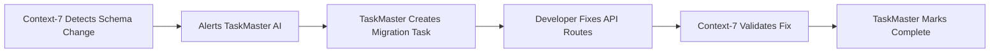
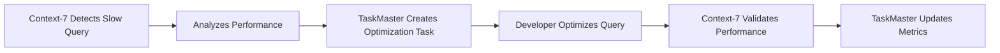
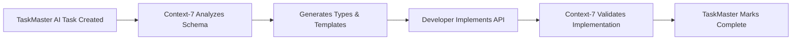

# 🔌 Context-7 MCP Integration Plan for Database Management

**Дата**: 26 сентября 2025  
**Статус**: ГОТОВ К ИНТЕГРАЦИИ  
**Цель**: Интеграция Context-7 MCP с COMETA для управления базой данных

## 🎯 Integration Overview

Context-7 MCP будет координировать с TaskMaster AI для обеспечения полного управления базой данных, мониторинга схем и автоматизации задач разработки.

## 🏗️ Architecture Integration

### Current Stack:

```
Next.js API Routes → Supabase Database
                 ↓
            TaskMaster AI (Task Management)
```

### Target Stack with Context-7 MCP:

```
Next.js API Routes → Supabase Database
                 ↓           ↓
        TaskMaster AI ←→ Context-7 MCP
     (Task Management)   (DB Management)
```

## 🔧 Context-7 MCP Responsibilities

### 1. **Database Schema Management**

- **Schema Monitoring**: Real-time tracking of database changes
- **Migration Validation**: Automatic validation of schema migrations
- **Type Generation**: Auto-generated TypeScript interfaces from schema
- **Change Alerts**: Notifications when schema drifts from API expectations

### 2. **Query Optimization**

- **Performance Monitoring**: Track slow queries and optimization opportunities
- **Index Recommendations**: Suggest database indexes for better performance
- **Query Analysis**: Analyze complex queries for optimization potential
- **Caching Strategies**: Recommend caching for frequently accessed data

### 3. **Data Integrity Management**

- **Constraint Validation**: Ensure foreign key relationships are maintained
- **Data Quality Checks**: Validate data consistency across tables
- **Backup Coordination**: Coordinate with backup and recovery systems
- **Audit Trail**: Track all database changes and access patterns

### 4. **Development Workflow Integration**

- **CI/CD Integration**: Validate schema changes in deployment pipeline
- **Code Generation**: Generate API routes from database schema
- **Testing Automation**: Create database tests for new features
- **Documentation Sync**: Keep database documentation up-to-date

## 📋 Integration Tasks for Context-7 MCP

### Phase 1: Basic Integration (Week 1)

1. **MCP Server Setup**
   - Install and configure Context-7 MCP server
   - Establish connection to Supabase database
   - Configure authentication and permissions

2. **Schema Validation Integration**
   - Connect Context-7 to existing [`SchemaValidator`](src/lib/schema-validator.ts:1)
   - Implement real-time schema monitoring
   - Set up alerts for schema changes

3. **TaskMaster AI Coordination**
   - Establish communication between Context-7 and TaskMaster AI
   - Share task progress for database-related work
   - Coordinate migration and validation tasks

### Phase 2: Advanced Features (Week 2)

1. **Performance Monitoring**
   - Implement query performance tracking
   - Set up slow query alerts
   - Create performance dashboards

2. **Automated Testing**
   - Generate database tests from schema
   - Automated regression testing
   - Performance benchmarking

3. **Code Generation**
   - Auto-generate TypeScript types
   - Create API route templates
   - Generate Zod validation schemas

### Phase 3: Production Optimization (Week 3)

1. **Production Monitoring**
   - Real-time database health monitoring
   - Automatic scaling recommendations
   - Security audit automation

2. **Advanced Analytics**
   - Query pattern analysis
   - Resource usage optimization
   - Predictive scaling alerts

## 🔌 MCP Tools Configuration

### Required Context-7 MCP Tools:

1. **`schema_monitor`**

   ```json
   {
     "name": "schema_monitor",
     "description": "Monitor database schema changes",
     "parameters": {
       "database_url": "supabase_connection",
       "tables": ["activity_logs", "crews", "equipment", "users"],
       "alert_on_changes": true
     }
   }
   ```

2. **`query_analyzer`**

   ```json
   {
     "name": "query_analyzer",
     "description": "Analyze query performance",
     "parameters": {
       "threshold_ms": 500,
       "log_slow_queries": true,
       "suggest_optimizations": true
     }
   }
   ```

3. **`type_generator`**

   ```json
   {
     "name": "type_generator",
     "description": "Generate TypeScript from schema",
     "parameters": {
       "output_path": "src/types/database.ts",
       "interface_prefix": "DB",
       "include_relations": true
     }
   }
   ```

4. **`migration_validator`**
   ```json
   {
     "name": "migration_validator",
     "description": "Validate database migrations",
     "parameters": {
       "validate_constraints": true,
       "check_data_integrity": true,
       "performance_impact": true
     }
   }
   ```

## 🤖 TaskMaster AI + Context-7 MCP Workflows

### Workflow 1: Schema Change Detection



### Workflow 2: Performance Optimization



### Workflow 3: API Development



## 📊 Monitoring & Alerting

### Context-7 MCP Alerts:

- 🚨 **Schema Drift**: When API tries to access non-existent fields
- ⚡ **Performance Issues**: When queries exceed 500ms threshold
- 🔒 **Security Concerns**: Unusual access patterns or failed validations
- 📈 **Resource Usage**: Database resource consumption alerts

### TaskMaster AI Coordination:

- 📋 **Auto-Task Creation**: Automatic tasks for detected issues
- 📊 **Progress Tracking**: Real-time progress on database-related tasks
- 🎯 **Priority Management**: Dynamic prioritization based on impact
- 📝 **Documentation Updates**: Automatic documentation updates

## 🎯 Expected Benefits

### Development Efficiency:

- ✅ **Automated Error Prevention**: Schema validation prevents 500 errors
- ✅ **Faster Development**: Auto-generated types and templates
- ✅ **Reduced Debugging**: Clear error messages and validation
- ✅ **Quality Assurance**: Automated testing and validation

### System Reliability:

- ✅ **Zero Schema Errors**: Continuous validation prevents mismatches
- ✅ **Performance Monitoring**: Proactive optimization
- ✅ **Data Integrity**: Automated constraint and consistency checks
- ✅ **Security Hardening**: Continuous security validation

### Team Productivity:

- ✅ **Coordinated Workflows**: TaskMaster + Context-7 integration
- ✅ **Automated Documentation**: Always up-to-date API docs
- ✅ **Clear Task Management**: Automatic task creation and tracking
- ✅ **Reduced Manual Work**: Automated validation and monitoring

## 🚀 Implementation Roadmap

### Week 1: Foundation

- [ ] Install and configure Context-7 MCP server
- [ ] Connect to Supabase database with proper credentials
- [ ] Integrate with existing [`SchemaValidator`](src/lib/schema-validator.ts:1)
- [ ] Establish TaskMaster AI communication

### Week 2: Core Features

- [ ] Implement schema monitoring and alerts
- [ ] Set up query performance tracking
- [ ] Create automated type generation pipeline
- [ ] Build migration validation system

### Week 3: Advanced Integration

- [ ] Create comprehensive monitoring dashboards
- [ ] Implement predictive analytics for database health
- [ ] Build automated optimization recommendations
- [ ] Complete TaskMaster AI workflow integration

## 🎊 Success Criteria

### Technical Success:

- ✅ **Context-7 MCP Connected**: Successful database connection
- ✅ **Schema Monitoring Active**: Real-time validation working
- ✅ **TaskMaster Integration**: Coordinated task management
- ✅ **Performance Tracking**: <500ms query monitoring

### Business Success:

- ✅ **Zero Database Errors**: Proactive error prevention
- ✅ **Enhanced Developer Experience**: Automated workflows
- ✅ **Improved System Reliability**: Continuous monitoring
- ✅ **Reduced Maintenance Overhead**: Automated management

## 🔮 Future Enhancements

### Advanced Context-7 Features:

1. **AI-Powered Optimization**: Machine learning for query optimization
2. **Predictive Scaling**: Automatic resource scaling recommendations
3. **Advanced Security**: AI-powered threat detection
4. **Business Intelligence**: Automated reporting and analytics

### Integration Expansion:

1. **CI/CD Pipeline**: Full deployment automation
2. **Multi-Environment**: Development, staging, production coordination
3. **Team Collaboration**: Enhanced developer coordination tools
4. **Customer Analytics**: Business intelligence integration

---

**Статус**: Готов к интеграции Context-7 MCP для завершения полной автоматизации управления базой данных в координации с TaskMaster AI.
