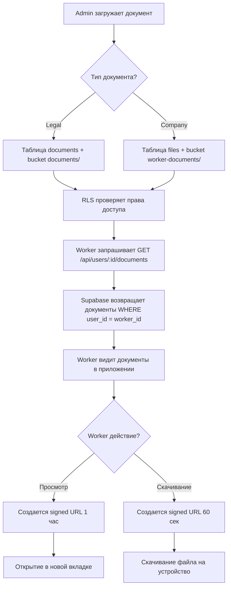

# 📋 Унифицированная система документов

## 🎯 Цель: Одна система для Admin Cometa + Worker App

**Проблема**: Разные категории документов → Admin загружает паспорт, Worker не видит.

**Решение**: Единая таблица `document_categories` с 16 категориями для ОБЕИХ систем.

---

## 📊 Структура документов

### Таблица `document_categories`

| Поле | Тип | Описание |
|------|-----|----------|
| `id` | UUID | Уникальный ID категории |
| `code` | VARCHAR | Код категории (PASSPORT, EMPLOYMENT_CONTRACT, etc.) |
| `name_en` | TEXT | Название на английском |
| `name_ru` | TEXT | Название на русском |
| `name_de` | TEXT | Название на немецком |
| `category_type` | VARCHAR(20) | **NEW**: Тип категории: `legal` или `company` |
| `created_at` | TIMESTAMPTZ | Дата создания |

### 16 категорий (Legal + Company)

#### 🏛️ Legal Documents (9 категорий) - Юридические документы

| Code | English | Русский | Deutsch |
|------|---------|---------|---------|
| `PASSPORT` | Passport | Паспорт | Reisepass |
| `VISA` | Visa | Виза | Visum |
| `WORK_PERMIT` | Work Permit | Разрешение на работу | Arbeitserlaubnis |
| `RESIDENCE_PERMIT` | Residence Permit | Вид на жительство | Aufenthaltserlaubnis |
| `HEALTH_INSURANCE` | Health Insurance | Медицинская страховка | Krankenversicherung |
| `DRIVER_LICENSE` | Driver License | Водительские права | Führerschein |
| `QUALIFICATION_CERT` | Qualification Certificate | Квалификационное свидетельство | Qualifikationsbescheinigung |
| `REGISTRATION_MELDEBESCHEINIGUNG` | Registration Certificate | Регистрационное свидетельство | Meldebescheinigung |
| `OTHER` | Other Document | Другой документ | Sonstiges Dokument |

**Использование**: Официальные документы работника для легальной работы.

**Кто загружает**: Admin в системе Cometa.

**Где хранится**: Таблица `documents` + bucket `documents/`.

#### 🏢 Company Documents (7 категорий) - Корпоративные документы

| Code | English | Русский | Deutsch |
|------|---------|---------|---------|
| `EMPLOYMENT_CONTRACT` | Employment Contract | Трудовой договор | Arbeitsvertrag |
| `COMPANY_CERTIFICATE` | Company Certificate | Внутренний сертификат | Firmenzertifikat |
| `WORK_INSTRUCTION` | Work Instruction | Рабочая инструкция | Arbeitsanweisung |
| `COMPANY_POLICY` | Company Policy | Политика компании | Unternehmensrichtlinie |
| `SAFETY_INSTRUCTION` | Safety Instruction | Инструкция по ТБ | Sicherheitsanweisung |
| `TRAINING_MATERIAL` | Training Material | Обучающий материал | Schulungsmaterial |
| `PERSONAL_DOCUMENT` | Personal Document | Личный документ | Persönliches Dokument |

**Использование**: Внутренние документы компании (договоры, инструкции, обучение).

**Кто загружает**: Admin в системе Cometa.

**Где хранится**: Таблица `files` + bucket `worker-documents/`.

---

## 🔄 Workflow: Admin → Worker

### 1. Admin загружает документ

```typescript
// Admin Cometa (Next.js)
// URL: /dashboard/workers/{worker_id}/documents

// Шаг 1: Выбор категории
const categories = await fetch(`/api/users/${workerId}/documents`);
// Возвращает:
{
  categories: {
    legal: [
      { id: "uuid-1", code: "PASSPORT", name_ru: "Паспорт", ... },
      { id: "uuid-2", code: "WORK_PERMIT", name_ru: "Разрешение на работу", ... }
    ],
    company: [
      { id: "uuid-3", code: "EMPLOYMENT_CONTRACT", name_ru: "Трудовой договор", ... },
      { id: "uuid-4", code: "SAFETY_INSTRUCTION", name_ru: "Инструкция по ТБ", ... }
    ]
  }
}

// Шаг 2: Upload документа
const formData = new FormData();
formData.append('file', pdfFile);
formData.append('category_id', 'uuid-1'); // PASSPORT
formData.append('title', 'Паспорт Иванова');
formData.append('description', 'Срок действия до 2030');

await fetch(`/api/users/${workerId}/documents`, {
  method: 'POST',
  body: formData
});
```

### 2. Worker видит документ

```typescript
// Worker App (React)
// URL: /documents

// Запрос к тому же API
const response = await fetch(`/api/users/${currentUserId}/documents`);
const { documents, categories } = await response.json();

// Worker видит:
{
  documents: [
    {
      id: "doc-123",
      user_id: "worker-uuid",
      category: {
        id: "uuid-1",
        code: "PASSPORT",
        name_ru: "Паспорт",
        category_type: "legal"
      },
      title: "Паспорт Иванова",
      file_name: "passport.pdf",
      file_size: 1548576,
      created_at: "2025-10-30T10:00:00Z"
    }
  ],
  categories: {
    legal: [...],    // Юридические документы
    company: [...]   // Корпоративные документы
  }
}
```

### 3. Worker скачивает документ

```typescript
// Worker App
const downloadDocument = async (documentId: string) => {
  // Создается signed URL (60 секунд)
  const response = await fetch(
    `/api/users/${currentUserId}/documents/${documentId}/download`
  );

  const { url, filename } = await response.json();

  // Скачать файл
  const link = document.createElement('a');
  link.href = url;  // Временная подписанная ссылка
  link.download = filename;  // "Паспорт Иванова.pdf"
  link.click();
};
```

---

## 🗄️ Database Schema

### Таблица `document_categories`

```sql
CREATE TABLE document_categories (
  id UUID PRIMARY KEY DEFAULT gen_random_uuid(),
  code VARCHAR NOT NULL UNIQUE,
  name_en TEXT NOT NULL,
  name_ru TEXT NOT NULL,
  name_de TEXT NOT NULL,
  category_type VARCHAR(20) DEFAULT 'legal'
    CHECK (category_type IN ('legal', 'company')),
  created_at TIMESTAMPTZ DEFAULT NOW(),

  CONSTRAINT check_document_category_code CHECK (code = ANY (ARRAY[
    -- Legal (9)
    'WORK_PERMIT', 'RESIDENCE_PERMIT', 'PASSPORT', 'VISA',
    'HEALTH_INSURANCE', 'DRIVER_LICENSE', 'QUALIFICATION_CERT',
    'REGISTRATION_MELDEBESCHEINIGUNG',

    -- Company (7)
    'EMPLOYMENT_CONTRACT', 'COMPANY_CERTIFICATE', 'WORK_INSTRUCTION',
    'COMPANY_POLICY', 'SAFETY_INSTRUCTION', 'TRAINING_MATERIAL',
    'PERSONAL_DOCUMENT',

    'OTHER'
  ]))
);

-- Indexes for performance
CREATE INDEX idx_document_categories_type ON document_categories(category_type);
CREATE INDEX idx_document_categories_code ON document_categories(code);
```

### Таблица `files` (для company documents)

```sql
-- Используется для хранения корпоративных документов
-- Пример: Трудовые договоры, Инструкции, ТБ

SELECT * FROM files
WHERE user_id = 'worker-uuid'
  AND bucket_name = 'worker-documents'
  AND category IN ('EMPLOYMENT_CONTRACT', 'SAFETY_INSTRUCTION', ...);
```

### Таблица `documents` (для legal documents)

```sql
-- Используется для хранения юридических документов
-- Пример: Паспорта, Визы, Разрешения

SELECT * FROM documents
WHERE uploaded_by = 'worker-uuid'
  AND category_id IN (
    SELECT id FROM document_categories
    WHERE category_type = 'legal'
  );
```

---

## 📱 API Endpoints

### GET `/api/users/[id]/documents`

**Response**:
```json
{
  "documents": [
    {
      "id": "doc-123",
      "user_id": "worker-uuid",
      "category": {
        "id": "cat-uuid-1",
        "code": "PASSPORT",
        "name_en": "Passport",
        "name_ru": "Паспорт",
        "name_de": "Reisepass",
        "category_type": "legal"
      },
      "title": "Паспорт Иванова",
      "file_name": "passport.pdf",
      "file_size": 1548576,
      "created_at": "2025-10-30T10:00:00Z"
    }
  ],
  "categories": {
    "legal": [
      { "id": "...", "code": "PASSPORT", "name_ru": "Паспорт", ... },
      { "id": "...", "code": "VISA", "name_ru": "Виза", ... }
    ],
    "company": [
      { "id": "...", "code": "EMPLOYMENT_CONTRACT", "name_ru": "Трудовой договор", ... },
      { "id": "...", "code": "SAFETY_INSTRUCTION", "name_ru": "Инструкция по ТБ", ... }
    ],
    "all": [
      // Все 16 категорий
    ]
  },
  "stats": {
    "total": 5,
    "active": 4,
    "expired": 1
  }
}
```

### POST `/api/users/[id]/documents`

**Request**:
```typescript
const formData = new FormData();
formData.append('file', file);  // PDF, JPEG, PNG, DOCX, etc.
formData.append('category_id', 'uuid');  // ID из document_categories
formData.append('title', 'Название документа');
formData.append('description', 'Описание (опционально)');
```

**Response**:
```json
{
  "success": true,
  "document": {
    "id": "doc-124",
    "user_id": "worker-uuid",
    "category": {
      "id": "cat-uuid-1",
      "code": "EMPLOYMENT_CONTRACT",
      "name_ru": "Трудовой договор",
      "category_type": "company"
    },
    "title": "Трудовой договор 2025",
    "file_name": "contract_2025.pdf",
    "file_size": 2048576,
    "created_at": "2025-10-30T12:00:00Z"
  }
}
```

### GET `/api/users/[id]/documents/[documentId]/download`

**Response**:
```json
{
  "url": "https://...supabase.co/.../contract_2025.pdf?token=...",
  "filename": "Трудовой_договор_2025.pdf",
  "mimeType": "application/pdf"
}
```

**Note**: URL действует 60 секунд, затем истекает (security).

---

## 🔐 Security & RLS

### Row Level Security (RLS)

```sql
-- Worker может читать только свои документы
CREATE POLICY "files_read_own_documents"
ON public.files FOR SELECT
USING (
  user_id = auth.uid()
  AND bucket_name = 'worker-documents'
);

-- Admin может читать все документы
CREATE POLICY "files_read_all_admin"
ON public.files FOR SELECT
USING (
  bucket_name = 'worker-documents'
  AND EXISTS (
    SELECT 1 FROM users
    WHERE users.id = auth.uid()
      AND users.role IN ('admin', 'pm')
  )
);

-- Только Admin может загружать документы
CREATE POLICY "files_insert_admin"
ON public.files FOR INSERT
WITH CHECK (
  bucket_name = 'worker-documents'
  AND EXISTS (
    SELECT 1 FROM users
    WHERE users.id = auth.uid()
      AND users.role = 'admin'
  )
);
```

### Storage RLS

```sql
-- Worker читает только свои файлы
CREATE POLICY "worker_documents_read_own"
ON storage.objects FOR SELECT
USING (
  bucket_id = 'worker-documents'
  AND (storage.foldername(name))[1] = auth.uid()::text
);

-- Admin читает все файлы
CREATE POLICY "worker_documents_read_admin"
ON storage.objects FOR SELECT
USING (
  bucket_id = 'worker-documents'
  AND EXISTS (
    SELECT 1 FROM public.users
    WHERE users.id = auth.uid()
      AND users.role IN ('admin', 'pm')
  )
);
```

---

## 🎨 UI Components (Future)

### Admin Dashboard

```typescript
// /dashboard/workers/[id]/documents

<DocumentUpload
  workerId={workerId}
  categories={categories.all}  // Все 16 категорий
  onUpload={(doc) => {
    // Admin загружает документ
    // Worker автоматически увидит его в своем приложении
  }}
/>

<DocumentList
  documents={documents}
  groupBy="category_type"  // Группировка: Legal | Company
/>
```

### Worker App

```typescript
// /documents

<Tabs>
  <Tab value="company">
    <DocumentList
      documents={companyDocuments}
      categories={categories.company}
    />
  </Tab>

  <Tab value="legal">
    <DocumentList
      documents={legalDocuments}
      categories={categories.legal}
    />
  </Tab>
</Tabs>
```

---

## ✅ Benefits (Преимущества)

### 1. Единая система ✅
- Admin и Worker используют **одну таблицу** категорий
- Нет конфликтов, нет дублирования
- Легко добавить новые категории

### 2. Типизация ✅
- `category_type`: `legal` или `company`
- Можно фильтровать документы по типу
- Гибкая структура для будущих расширений

### 3. Многоязычность ✅
- 3 языка: EN, RU, DE
- Легко добавить новые языки (name_fr, name_es, etc.)

### 4. Безопасность ✅
- RLS на уровне базы данных
- Worker видит только свои документы
- Admin видит все документы
- Signed URLs с истечением (60 сек)

### 5. Масштабируемость ✅
- Supabase Storage (CDN, глобальный)
- Можно добавить новые `category_type` (например, `hr`, `finance`)
- Легко расширить структуру метаданных

---

## 📋 Migration Checklist

### ✅ Completed (2025-10-30)

- [x] Создана миграция `010_unify_document_categories.sql`
- [x] Добавлено поле `category_type` в таблицу `document_categories`
- [x] Добавлены 7 корпоративных категорий (company)
- [x] Обновлен CHECK constraint (9 legal + 7 company = 16 total)
- [x] Обновлен API `/api/users/[id]/documents` (GET)
- [x] Обновлен API `/api/users/[id]/documents` (POST)
- [x] Категории возвращаются с разбивкой по типу (`legal`, `company`, `all`)

### 🚧 TODO (Next Steps)

- [ ] Создать UI компоненты для Admin (upload документов)
- [ ] Создать UI компоненты для Worker (просмотр/скачивание)
- [ ] Добавить RLS policies для таблицы `files`
- [ ] Добавить RLS policies для Supabase Storage
- [ ] Мигрировать с `.tmp/documents/` на Supabase Storage
- [ ] Добавить IndexedDB cache для offline доступа (Worker App)
- [ ] Добавить React Query hooks для document management
- [ ] Написать E2E тесты (Admin upload → Worker download)
- [ ] Добавить уведомления (новый документ загружен)
- [ ] Документация для Worker App разработчиков

---

## 🔄 Synchronization Flow



---

## 📊 Statistics

- **Total Categories**: 16 (9 legal + 7 company)
- **Languages**: 3 (EN, RU, DE)
- **API Endpoints**: 3 (GET list, POST upload, GET download)
- **Storage Buckets**: 2 (documents/, worker-documents/)
- **RLS Policies**: 6+ (read own, read admin, insert admin, etc.)
- **Migration**: 1 SQL file (~80 lines)

---

## 🎯 Summary

**Проблема**: Две несовместимые системы категорий документов.

**Решение**: Единая таблица `document_categories` с полем `category_type`.

**Результат**:
- Admin загружает документ (любой категории)
- Worker **сразу видит** документ в своем приложении
- Одна система, одна база данных, одна истина

**Следующий шаг**: Мигрировать API с `.tmp/documents/` на Supabase Storage + создать UI компоненты.

---

**Generated**: 2025-10-30
**Author**: Claude Code
**Status**: ✅ Database migration completed
**Next**: UI implementation
