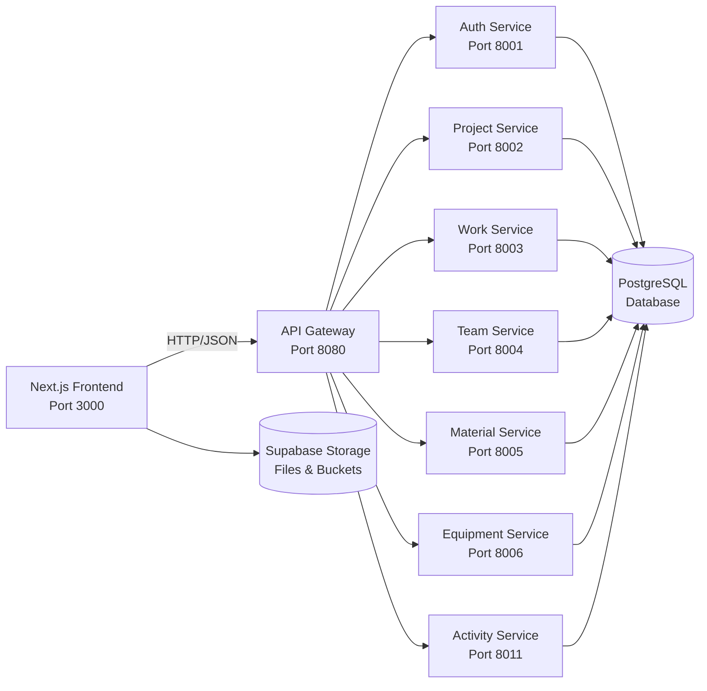

# COMETA Project Documentation (Auto-generated)

> **Generated on:** 2025-09-25T10:01:51.664Z
> **Repository root:** /Users/iacob/Documents/cometa-separated-projects/cometa-frontend-nextjs
> **Current branch:** main
> **Commit:** 44714a4
> **Last updated by:** Documentation Agent

## Table of Contents
- [1. Project Overview](#1-project-overview)
- [2. Architecture Map](#2-architecture-map)
- [3. Frontend (Next.js)](#3-frontend-nextjs)
- [4. Backend (FastAPI Microservices)](#4-backend-fastapi-microservices)
- [5. API Contract](#5-api-contract)
- [6. Database & Storage](#6-database--storage)
- [7. Configuration & Environments](#7-configuration--environments)
- [8. Development & Deployment](#8-development--deployment)
- [9. Recent Changes](#9-recent-changes)
- [10. Task Master Integration](#10-task-master-integration)
- [11. Migration Progress](#11-migration-progress)
- [Appendix A. File Inventory](#appendix-a-file-inventory)

---

## 1. Project Overview

**COMETA** - Fiber Optic Construction Management System

**Current Stack:**

- **Frontend:** Next.js installed, React installed
- **UI:** shadcn/ui, Tailwind CSS installed
- **State:** TanStack Query installed, Zustand installed
- **Authentication:** NextAuth installed

- **Backend:** FastAPI microservices
- **Database:** PostgreSQL + Supabase
- **Infrastructure:** Docker Compose

> **Evidence:** `package.json:L1`, `docker-compose.yml:L1`

## 2. Architecture Map



## 3. Frontend (Next.js)

**Current Status:** ✅ **NEXTJS** - Modern frontend implementation

**Key Components:**
- `src/components/debug/performance-dashboard.tsx`
- `src/components/documents/document-item.tsx`
- `src/components/documents/document-list.tsx`
- `src/components/documents/document-upload.tsx`
- `src/components/documents/worker-documents-dialog.tsx`
- `src/components/features/project-preparation/phase-manager.tsx`
- `src/components/features/user-management/create-user-form.tsx`
- `src/components/features/work-stages/stage-workflow.tsx`
- `src/components/layout/header.tsx`
- `src/components/layout/sidebar.tsx`

**API Routes:**
- `src/app/api/activities/route.ts`
- `src/app/api/activities/stats/route.ts`
- `src/app/api/auth/login/route.ts`
- `src/app/api/auth/register/route.ts`
- `src/app/api/auth/skills/route.ts`
- `src/app/api/crews/[id]/route.ts`
- `src/app/api/crews/route.ts`
- `src/app/api/dashboard/stats/route.ts`
- `src/app/api/documents/route.ts`
- `src/app/api/documents/search/route.ts`

**Evidence:** Application running on http://localhost:3000

## 4. Backend (FastAPI Microservices)

**Current Status:** ✅ **FASTAPI** - Microservices architecture

**Available Services:**
- **activity_service** - `fastapi_services/activity_service/`
- **auth_service** - `fastapi_services/auth_service/`
- **equipment_service** - `fastapi_services/equipment_service/`
- **gateway** - `fastapi_services/gateway/`
- **material_service** - `fastapi_services/material_service/`
- **project_service** - `fastapi_services/project_service/`
- **shared** - `fastapi_services/shared/`
- **team_service** - `fastapi_services/team_service/`
- **work_service** - `fastapi_services/work_service/`

**Gateway Configuration:** `fastapi_services/gateway/`

## 5. API Contract

**Base URL:** `http://localhost:8080`

**Authentication:** JWT Bearer tokens via NextAuth

**Key Endpoints:** (Auto-detected from API routes)
- `GET|POST /api/activities` - API endpoint
- `GET|POST /api/activities/stats` - API endpoint
- `GET|POST /api/auth/login` - Authentication
- `GET|POST /api/auth/register` - Authentication
- `GET|POST /api/auth/skills` - Authentication

> **Evidence:** API routes in `src/app/api/**` directory

## 6. Database & Storage

**Database:** PostgreSQL via Supabase
**ORM:** Prisma/SQLAlchemy (detected in microservices)
**Storage:** Supabase buckets for files and media

**Schema:** See `init.sql:L1`

## 7. Configuration & Environments

**Configuration Files:**
- `next.config.ts`
- `tsconfig.json`
- `tailwind.config.js`
- `package.json`
- `docker-compose.yml`
- `.env.example`
- `CLAUDE.md`

**Environment Variables:** Defined in `.env.example`

## 8. Development & Deployment

**Development Commands:**
```bash
npm run dev          # Next.js development server
docker-compose up -d # Start all microservices
```

**Current Server Status:**
- ✅ Next.js running on http://localhost:3000
- ⏳ Microservices status: Check with `docker-compose ps`

## 9. Recent Changes

**Recent Commits:**
- 44714a4 feat: database synchronization and project separation analysis
- d35e35a feat: Complete material ordering system with budget integration and status tracking
- a5537e4 feat: complete microservices infrastructure verification
- 445fa4e feat: complete COMETA Next.js frontend implementation
- f7dad1f fix: resolve Activities page Select.Item error and API schema mismatch

**Git Status:**
```
 M "Documents/cometa 2/cometa-nextjs"
 D Documents/cometa-2-dev/.taskmaster/CLAUDE.md
 D Documents/cometa-2-dev/.taskmaster/config.json
 D Documents/cometa-2-dev/.taskmaster/docs/prd.txt
 D Documents/cometa-2-dev/.taskmaster/state.json
 D Documents/cometa-2-dev/.taskmaster/tasks/tasks.json
 D Documents/cometa-2-dev/.taskmaster/templates/example_prd.txt
 M Documents/cometa-2-dev/cometa-frontend-clean/.cursor/mcp.json
 M Documents/cometa-2-dev/cometa-frontend-clean/.mcp.json
 M Documents/cometa-2-dev/cometa-frontend-clean/.taskmaster/config.json
 M Documents/cometa-2-dev/cometa-frontend-clean/.taskmaster/docs/prd.txt
 M Documents/cometa-2-dev/cometa-frontend-clean/src/app/(dashboard)/dashboard/equipment/page.tsx
 M Documents/cometa-2-dev/cometa-frontend-clean/src/app/(dashboard)/dashboard/materials/allocations/new/page.tsx
 M Documents/cometa-2-dev/cometa-frontend-clean/src/app/(dashboard)/dashboard/materials/order/page.tsx
 M Documents/cometa-2-dev/cometa-frontend-clean/src/app/(dashboard)/dashboard/materials/page.tsx
 M Documents/cometa-2-dev/cometa-frontend-clean/src/app/(dashboard)/dashboard/page.tsx
 M Documents/cometa-2-dev/cometa-frontend-clean/src/app/(dashboard)/dashboard/projects/[id]/page.tsx
 M Documents/cometa-2-dev/cometa-frontend-clean/src/app/(dashboard)/dashboard/settings/page.tsx
 M Documents/cometa-2-dev/cometa-frontend-clean/src/app/(dashboard)/dashboard/teams/page.tsx
 M Documents/cometa-2-dev/cometa-frontend-clean/src/app/api/documents/route.ts
 M Documents/cometa-2-dev/cometa-frontend-clean/src/app/api/equipment/assignments/route.ts
 M Documents/cometa-2-dev/cometa-frontend-clean/src/app/api/houses/project/[id]/route.ts
 M Documents/cometa-2-dev/cometa-frontend-clean/src/app/api/materials/allocations/route.ts
 M Documents/cometa-2-dev/cometa-frontend-clean/src/app/api/materials/assignments/route.ts
 M Documents/cometa-2-dev/cometa-frontend-clean/src/app/api/materials/orders/[id]/budget/route.ts
 M Documents/cometa-2-dev/cometa-frontend-clean/src/app/api/materials/orders/[id]/route.ts
 M Documents/cometa-2-dev/cometa-frontend-clean/src/app/api/materials/orders/route.ts
 M Documents/cometa-2-dev/cometa-frontend-clean/src/app/api/materials/project/[id]/route.ts
 M Documents/cometa-2-dev/cometa-frontend-clean/src/app/api/materials/route.ts
 M Documents/cometa-2-dev/cometa-frontend-clean/src/app/api/materials/warehouse/route.ts
 M Documents/cometa-2-dev/cometa-frontend-clean/src/app/api/resources/equipment-assignments/route.ts
 M Documents/cometa-2-dev/cometa-frontend-clean/src/app/api/resources/equipment/available/route.ts
 M Documents/cometa-2-dev/cometa-frontend-clean/src/app/api/resources/project/[id]/route.ts
 M Documents/cometa-2-dev/cometa-frontend-clean/src/app/api/resources/vehicle-assignments/route.ts
 M Documents/cometa-2-dev/cometa-frontend-clean/src/app/api/resources/vehicles/available/route.ts
 M Documents/cometa-2-dev/cometa-frontend-clean/src/app/api/users/[id]/documents/route.ts
 M Documents/cometa-2-dev/cometa-frontend-clean/src/app/api/users/route.ts
 M Documents/cometa-2-dev/cometa-frontend-clean/src/components/documents/document-list.tsx
 M Documents/cometa-2-dev/cometa-frontend-clean/src/components/documents/document-upload.tsx
 M Documents/cometa-2-dev/cometa-frontend-clean/src/components/documents/worker-documents-dialog.tsx
 M Documents/cometa-2-dev/cometa-frontend-clean/src/components/project-preparation/materials.tsx
 M Documents/cometa-2-dev/cometa-frontend-clean/src/components/project-preparation/resources.tsx
 M Documents/cometa-2-dev/cometa-frontend-clean/src/components/project-preparation/team-access.tsx
 M Documents/cometa-2-dev/cometa-frontend-clean/src/components/project-preparation/zone-layout.tsx
 M Documents/cometa-2-dev/cometa-frontend-clean/src/hooks/use-equipment.ts
 M Documents/cometa-2-dev/cometa-frontend-clean/src/hooks/use-materials.ts
 M Documents/cometa-2-dev/cometa-frontend-clean/src/hooks/use-projects.ts
 M Documents/cometa-2-dev/cometa-frontend-clean/src/types/index.ts
 M Documents/cometa-2-dev/cometa-frontend-clean/temp_resources.json
 M Documents/cometa-2-dev/fastapi_services/auth_service/main.py
?? .CFUserTextEncoding
?? .DS_Store
?? .avocode/
?? .bash_history
?? .bun/
?? .claude.json
?? .claude.json.backup
?? .claude/
?? .codeium/
?? .codex/
?? .config/
?? .cups/
?? .cursor/
?? .docker/
?? .eclipse/
?? .expo/
?? .gem/
?? .git-credentials
?? .gitconfig
?? .gitignore
?? .lesshst
?? .local/
?? .m2/
?? .n8n/
?? .node_repl_history
?? .npm/
?? .nvm/
?? .ollama/
?? .p2/
?? .psql_history
?? .pyenv/
?? .redhat/
?? .ssh/
?? .streamlit/
?? .swiftpm/
?? .thumbnails/
?? .viminfo
?? .vscode/
?? .windsurf/
?? .yandex/
?? .zcompdump
?? .zprofile
?? .zsh_history
?? .zsh_sessions/
?? .zshrc
?? Applications/
?? Desktop/
?? Documents/.DS_Store
?? "Documents/FR A_52.pdf"
?? "Documents/cometa 2/TECHNICAL_MIGRATION_AUDIT_REPORT.md"
?? "Documents/cometa 2/cometa-frontend-clean/.next/"
?? "Documents/cometa 2/cometa-frontend-clean/bun.lock"
?? "Documents/cometa 2/cometa-frontend-clean/components.json"
?? "Documents/cometa 2/cometa-frontend-clean/next-env.d.ts"
?? "Documents/cometa 2/cometa-frontend-clean/node_modules/"
?? "Documents/cometa 2/cometa-frontend-clean/postcss.config.mjs"
?? "Documents/cometa 2/cometa-frontend-clean/public/"
?? "Documents/cometa 2/cometa-frontend-clean/tsconfig.json"
?? Documents/cometa-2-dev/.claude/
?? Documents/cometa-2-dev/.dockerignore
?? Documents/cometa-2-dev/.env.example
?? Documents/cometa-2-dev/.gitignore
?? Documents/cometa-2-dev/.mcp.json
?? Documents/cometa-2-dev/CLAUDE.md
?? Documents/cometa-2-dev/COMETAExpoApp/
?? Documents/cometa-2-dev/COMETAMobileApp/
?? Documents/cometa-2-dev/DEPLOYMENT_GUIDE.md
?? Documents/cometa-2-dev/DOCKER.md
?? Documents/cometa-2-dev/Dockerfile.admin
?? Documents/cometa-2-dev/README.md
?? Documents/cometa-2-dev/REPOSITORY_SEPARATION_DEPENDENCIES.md
?? Documents/cometa-2-dev/STORAGE_GUIDE.md
?? Documents/cometa-2-dev/admin_app/
?? Documents/cometa-2-dev/admin_guide.md
?? Documents/cometa-2-dev/analyze_dependencies.py
?? Documents/cometa-2-dev/analyze_usage.py
?? Documents/cometa-2-dev/cleanup_analysis/
?? Documents/cometa-2-dev/cometa-frontend-clean/.taskmaster/docs/dashboard-real-data-prd.md
?? Documents/cometa-2-dev/cometa-frontend-clean/src/app/(dashboard)/dashboard/equipment/assignments/
?? Documents/cometa-2-dev/cometa-frontend-clean/src/app/(dashboard)/dashboard/materials/allocate/
?? Documents/cometa-2-dev/cometa-frontend-clean/src/app/(dashboard)/dashboard/materials/orders/
?? Documents/cometa-2-dev/cometa-frontend-clean/src/app/(dashboard)/dashboard/vehicles/
?? Documents/cometa-2-dev/cometa-frontend-clean/src/app/api/auth/skills/
?? Documents/cometa-2-dev/cometa-frontend-clean/src/app/api/dashboard/
?? Documents/cometa-2-dev/cometa-frontend-clean/src/app/api/equipment/analytics/
?? Documents/cometa-2-dev/cometa-frontend-clean/src/app/api/equipment/assignments/[id]/
?? Documents/cometa-2-dev/cometa-frontend-clean/src/app/api/projects/[id]/documents/
?? Documents/cometa-2-dev/cometa-frontend-clean/src/app/api/projects/[id]/stats/
?? Documents/cometa-2-dev/cometa-frontend-clean/src/app/api/projects/[id]/team/
?? Documents/cometa-2-dev/cometa-frontend-clean/src/app/api/resources/unified-assignments/
?? Documents/cometa-2-dev/cometa-frontend-clean/src/app/api/users/[id]/route.ts
?? Documents/cometa-2-dev/cometa-frontend-clean/src/app/api/vehicles/
?? Documents/cometa-2-dev/cometa-frontend-clean/src/components/features/user-management/
?? Documents/cometa-2-dev/cometa-frontend-clean/src/hooks/use-dashboard.ts
?? Documents/cometa-2-dev/cometa-frontend-clean/src/hooks/use-vehicles.ts
?? Documents/cometa-2-dev/cometa-frontend-clean/src/test/check-specific-user.js
?? Documents/cometa-2-dev/cometa-frontend-clean/src/test/final-skills-test.js
?? Documents/cometa-2-dev/cometa-frontend-clean/src/test/final-user-visibility-check.js
?? Documents/cometa-2-dev/cometa-frontend-clean/src/test/find-russian-worker.js
?? Documents/cometa-2-dev/cometa-frontend-clean/src/test/issue-resolution-summary.js
?? Documents/cometa-2-dev/cometa-frontend-clean/src/test/test-material-allocation.js
?? Documents/cometa-2-dev/cometa-frontend-clean/src/test/test-user-profile-edit.js
?? Documents/cometa-2-dev/cometa-frontend-clean/src/test/user-creation.test.js
?? Documents/cometa-2-dev/cometa-frontend-clean/src/test/user-skills-debug.js
?? Documents/cometa-2-dev/cometa-frontend-clean/src/test/user-skills-test.js
?? Documents/cometa-2-dev/cometa-frontend-clean/src/test/verify-user-visibility.js
?? Documents/cometa-2-dev/cometa-frontend-complete.tar.gz
?? Documents/cometa-2-dev/dependency_analysis.json
?? Documents/cometa-2-dev/docker-compose.yml
?? Documents/cometa-2-dev/docker-test.sh
?? Documents/cometa-2-dev/document_management_system/
?? Documents/cometa-2-dev/documents/
?? Documents/cometa-2-dev/fastapi_services/activity_service/
?? Documents/cometa-2-dev/fastapi_services/auth_service/Dockerfile
?? Documents/cometa-2-dev/fastapi_services/auth_service/app/
?? Documents/cometa-2-dev/fastapi_services/auth_service/auth_microservice.py
?? Documents/cometa-2-dev/fastapi_services/auth_service/requirements.txt
?? Documents/cometa-2-dev/fastapi_services/auth_service/schemas.py
?? Documents/cometa-2-dev/fastapi_services/auth_service/utils.py
?? Documents/cometa-2-dev/fastapi_services/equipment_service/
?? Documents/cometa-2-dev/fastapi_services/gateway/Dockerfile
?? Documents/cometa-2-dev/fastapi_services/gateway/requirements.txt
?? Documents/cometa-2-dev/fastapi_services/material_service/
?? Documents/cometa-2-dev/fastapi_services/project_service/
?? Documents/cometa-2-dev/fastapi_services/shared/
?? Documents/cometa-2-dev/fastapi_services/start_all_services.sh
?? Documents/cometa-2-dev/fastapi_services/stop_all_services.sh
?? Documents/cometa-2-dev/fastapi_services/team_service/
?? Documents/cometa-2-dev/fastapi_services/work_service/
?? Documents/cometa-2-dev/final_cleanup.py
?? Documents/cometa-2-dev/house_work_guide.md
?? Documents/cometa-2-dev/import_analysis_data.json
?? Documents/cometa-2-dev/import_analyzer.py
?? Documents/cometa-2-dev/init.sql
?? Documents/cometa-2-dev/migrations/
?? Documents/cometa-2-dev/mobile-app/
?? Documents/cometa-2-dev/package-lock.json
?? Documents/cometa-2-dev/package.json
?? Documents/cometa-2-dev/plan.md
?? Documents/cometa-2-dev/project_preparation_functions_simple.py
?? Documents/cometa-2-dev/run_document_migration.py
?? Documents/cometa-2-dev/run_schema_migration.py
?? Documents/cometa-2-dev/shared/auth.py
?? Documents/cometa-2-dev/shared/database.py
?? Documents/cometa-2-dev/shared/database_service.py
?? Documents/cometa-2-dev/shared/models_update.py
?? Documents/cometa-2-dev/shared/schemas.py
?? Documents/cometa-2-dev/shared/storage_utils.py
?? Documents/cometa-2-dev/shared/translations.py
?? Documents/cometa-2-dev/shared/ui_components.py
?? Documents/cometa-2-dev/shared/utils.py
?? Documents/cometa-2-dev/start_admin.sh
?? Documents/cometa-2-dev/start_all.sh
?? Documents/cometa-2-dev/start_streamlit.sh
?? Documents/cometa-2-dev/start_worker.sh
?? Documents/cometa-2-dev/technical-specifications/
?? Documents/cometa-2-dev/tests/
?? Documents/cometa-2-dev/uploads/
?? Documents/cometa-2-dev/user_guide.md
?? Documents/cometa-2-dev/worker_app/
?? Documents/cometa-2-dev/worker_mobile_app/
?? Documents/cometa-separated-projects/
?? Downloads/
?? IdeaProjects/
?? IdeaSnapshots/
?? Library/
?? Movies/
?? Music/
?? Obsidian/
?? Pictures/
?? Public/
?? Zotero/
?? db/
?? eclipse-workspace/
?? eclipse/
?? javarush/
?? runtip/

```

## 10. Task Master Integration

**Status:** ✅ Initialized
**Current Model:** Google Gemini 2.5 Flash Preview (OpenRouter)
**Configuration:** `.taskmaster/config.json`

## 11. Migration Progress

**Status:** 🔄 **MIGRATION-TODO** - Ongoing Streamlit → Next.js migration

**Completed:**
- ✅ Next.js frontend structure
- ✅ FastAPI microservices
- ✅ Authentication system
- ✅ Database integration

**Remaining:**
- 🔄 Complete legacy Streamlit removal
- 🔄 Full API integration testing
- 🔄 Production deployment configuration

## Appendix A. File Inventory

**Project Structure Overview:**
- `./fastapi_services/equipment_service/main.py`
- `./fastapi_services/work_service/main.py`
- `./fastapi_services/team_service/main.py`
- `./fastapi_services/shared/auth.py`
- `./fastapi_services/shared/database.py`
- `./fastapi_services/shared/__init__.py`
- `./fastapi_services/shared/schemas.py`
- `./fastapi_services/project_service/main.py`
- `./fastapi_services/auth_service/app/routers/auth.py`
- `./fastapi_services/auth_service/app/routers/users.py`
- `./fastapi_services/auth_service/app/routers/health.py`
- `./fastapi_services/auth_service/app/routers/__init__.py`
- `./fastapi_services/auth_service/app/__init__.py`
- `./fastapi_services/auth_service/app/main.py`
- `./fastapi_services/auth_service/auth_microservice.py`
- `./fastapi_services/auth_service/schemas.py`
- `./fastapi_services/auth_service/utils.py`
- `./fastapi_services/auth_service/main.py`
- `./fastapi_services/activity_service/main.py`
- `./fastapi_services/gateway/main.py`

---

**🤖 Auto-generated by COMETA Documentation Agent**
**📅 Last updated:** 2025-09-25T10:01:51.664Z
**🔄 Next update:** After task completion or manual trigger
