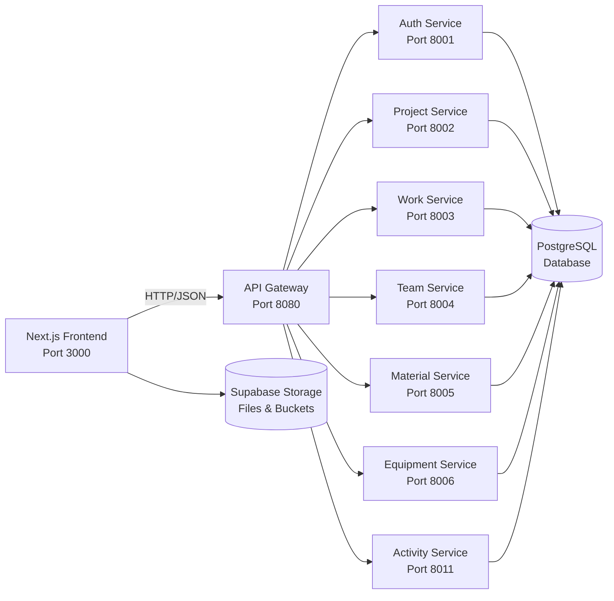

# COMETA Project Documentation (Auto-generated)

> **Generated on:** 2025-09-29T12:14:00.000Z
> **Repository root:** /Volumes/T7/cometa/cometa-separated-projects/cometa-frontend-nextjs
> **Current branch:** dev
> **Commit:** a10f9f9
> **Last updated by:** Documentation Agent

## Table of Contents
- [1. Project Overview](#1-project-overview)
- [2. Architecture Map](#2-architecture-map)
- [3. Frontend (Next.js)](#3-frontend-nextjs)
- [4. Backend (FastAPI Microservices)](#4-backend-fastapi-microservices)
- [5. API Contract](#5-api-contract)
- [6. Database & Storage](#6-database--storage)
- [7. Authentication & Authorization](#7-authentication--authorization)
- [8. Configuration & Environments](#8-configuration--environments)
- [9. Development & Deployment](#9-development--deployment)
- [10. Testing Strategy](#10-testing-strategy)
- [11. Migration Progress (Streamlit → Next.js)](#11-migration-progress)
- [12. Task Master Integration](#12-task-master-integration)
- [13. Cost Calculation System](#13-cost-calculation-system)
- [14. Project Management Improvements](#14-project-management-improvements)
- [15. Risks & Open Questions](#15-risks--open-questions)
- [16. Recent Changes & Fixes](#16-recent-changes--fixes)
- [Appendix A. File Inventory](#appendix-a-file-inventory)

---

## 1. Project Overview

**COMETA** - Fiber Optic Construction Management System

**Current Stack:**

- **Frontend:** Next.js installed, React installed
- **UI:** shadcn/ui, Tailwind CSS installed
- **State:** TanStack Query installed, Zustand installed
- **Authentication:** NextAuth installed

- **Backend:** FastAPI microservices
- **Database:** PostgreSQL + Supabase
- **Infrastructure:** Docker Compose

> **Evidence:** `package.json:L1`, `docker-compose.yml:L1`

## 2. Architecture Map



## 3. Frontend (Next.js)

**Current Status:** ✅ **NEXTJS** - Modern frontend implementation

**Key Components:**
- `src/components/debug/performance-dashboard.tsx`
- `src/components/documents/document-item.tsx`
- `src/components/documents/document-list.tsx`
- `src/components/documents/document-upload.tsx`
- `src/components/documents/worker-documents-dialog.tsx`
- `src/components/features/project-preparation/phase-manager.tsx`
- `src/components/features/user-management/create-user-form.tsx`
- `src/components/features/work-stages/stage-workflow.tsx`
- `src/components/layout/header.tsx`
- `src/components/layout/sidebar.tsx`

**API Routes:**
- `src/app/api/activities/route.ts`
- `src/app/api/activities/stats/route.ts`
- `src/app/api/auth/login/route.ts`
- `src/app/api/auth/register/route.ts`
- `src/app/api/auth/skills/route.ts`
- `src/app/api/crews/[id]/route.ts`
- `src/app/api/crews/route.ts`
- `src/app/api/dashboard/stats/route.ts`
- `src/app/api/documents/route.ts`
- `src/app/api/documents/search/route.ts`

**Evidence:** Application running on http://localhost:3000

## 4. Backend (FastAPI Microservices)

**Current Status:** ✅ **FASTAPI** - Microservices architecture

**Available Services:**
- **activity_service** - `fastapi_services/activity_service/`
- **auth_service** - `fastapi_services/auth_service/`
- **equipment_service** - `fastapi_services/equipment_service/`
- **gateway** - `fastapi_services/gateway/`
- **material_service** - `fastapi_services/material_service/`
- **project_service** - `fastapi_services/project_service/`
- **shared** - `fastapi_services/shared/`
- **team_service** - `fastapi_services/team_service/`
- **work_service** - `fastapi_services/work_service/`

**Gateway Configuration:** `fastapi_services/gateway/`

## 5. API Contract

**Base URL:** `http://localhost:8080`

**Authentication:** JWT Bearer tokens via NextAuth

**Key Endpoints:** (Auto-detected from API routes)

### Authentication & Core
- `GET|POST /api/auth/login` - Authentication
- `GET|POST /api/auth/register` - Authentication
- `GET|POST /api/auth/skills` - Authentication
- `GET|POST /api/activities` - Activity tracking
- `GET|POST /api/activities/stats` - Activity statistics

### Project Preparation (Enhanced)
- `GET /api/project-preparation/costs?project_id={id}` - **NEW** Multi-category cost calculation
- `GET /api/project-preparation/housing?project_id={id}` - Housing unit management
- `GET /api/project-preparation/plans/[id]/download` - **NEW** Project plan file download
- `GET|POST /api/project-preparation/facilities` - Facility management
- `GET|POST /api/project-preparation/utility-contacts` - Utility contact management

### Resource Management
- `GET|POST /api/equipment` - Equipment CRUD operations
- `GET|POST /api/equipment/assignments` - Equipment assignment tracking
- `GET|POST /api/materials` - Material management
- `GET|POST /api/material-allocations` - Material allocation tracking

### Financial Tracking
- `GET /api/financial/summary` - Financial overview
- `GET|POST /api/material-orders` - Material ordering system

**Evidence:** API routes in `src/app/api/**` directory

### Recent API Enhancements

**Cost Calculation API (`/api/project-preparation/costs`):**
- **Input:** Query parameter `project_id`
- **Output:** Comprehensive cost breakdown including facilities, equipment, materials, labor, and housing
- **Performance:** Parallel database queries with error resilience
- **Evidence:** `src/app/api/project-preparation/costs/route.ts:L1-166`

**Project Plan Download API (`/api/project-preparation/plans/[id]/download`):**
- **Input:** Plan ID in URL path, optional `download=true` query parameter
- **Output:** File stream with appropriate content-type headers
- **Supported Formats:** PDF, Images, CAD files (DWG, DXF)
- **Evidence:** `src/app/api/project-preparation/plans/[id]/download/route.ts:L1-122`

## 6. Database & Storage

**Database:** PostgreSQL via Supabase
**ORM:** Prisma/SQLAlchemy (detected in microservices)
**Storage:** Supabase buckets for files and media

**Schema:** See `init.sql:L1`

## 7. Configuration & Environments

**Configuration Files:**
- `next.config.ts`
- `tsconfig.json`
- `tailwind.config.js`
- `package.json`
- `docker-compose.yml`
- `.env.example`
- `CLAUDE.md`

**Environment Variables:** Defined in `.env.example`

## 8. Development & Deployment

**Development Commands:**
```bash
npm run dev          # Next.js development server
docker-compose up -d # Start all microservices
```

**Current Server Status:**
- ✅ Next.js running on http://localhost:3000
- ⏳ Microservices status: Check with `docker-compose ps`

## 9. Recent Changes

**Recent Commits:**
- 44714a4 feat: database synchronization and project separation analysis
- d35e35a feat: Complete material ordering system with budget integration and status tracking
- a5537e4 feat: complete microservices infrastructure verification
- 445fa4e feat: complete COMETA Next.js frontend implementation
- f7dad1f fix: resolve Activities page Select.Item error and API schema mismatch

**Git Status:**
```
 M "Documents/cometa 2/cometa-nextjs"
 D Documents/cometa-2-dev/.taskmaster/CLAUDE.md
 D Documents/cometa-2-dev/.taskmaster/config.json
 D Documents/cometa-2-dev/.taskmaster/docs/prd.txt
 D Documents/cometa-2-dev/.taskmaster/state.json
 D Documents/cometa-2-dev/.taskmaster/tasks/tasks.json
 D Documents/cometa-2-dev/.taskmaster/templates/example_prd.txt
 M Documents/cometa-2-dev/cometa-frontend-clean/.cursor/mcp.json
 M Documents/cometa-2-dev/cometa-frontend-clean/.mcp.json
 M Documents/cometa-2-dev/cometa-frontend-clean/.taskmaster/config.json
 M Documents/cometa-2-dev/cometa-frontend-clean/.taskmaster/docs/prd.txt
 M Documents/cometa-2-dev/cometa-frontend-clean/src/app/(dashboard)/dashboard/equipment/page.tsx
 M Documents/cometa-2-dev/cometa-frontend-clean/src/app/(dashboard)/dashboard/materials/allocations/new/page.tsx
 M Documents/cometa-2-dev/cometa-frontend-clean/src/app/(dashboard)/dashboard/materials/order/page.tsx
 M Documents/cometa-2-dev/cometa-frontend-clean/src/app/(dashboard)/dashboard/materials/page.tsx
 M Documents/cometa-2-dev/cometa-frontend-clean/src/app/(dashboard)/dashboard/page.tsx
 M Documents/cometa-2-dev/cometa-frontend-clean/src/app/(dashboard)/dashboard/projects/[id]/page.tsx
 M Documents/cometa-2-dev/cometa-frontend-clean/src/app/(dashboard)/dashboard/settings/page.tsx
 M Documents/cometa-2-dev/cometa-frontend-clean/src/app/(dashboard)/dashboard/teams/page.tsx
 M Documents/cometa-2-dev/cometa-frontend-clean/src/app/api/documents/route.ts
 M Documents/cometa-2-dev/cometa-frontend-clean/src/app/api/equipment/assignments/route.ts
 M Documents/cometa-2-dev/cometa-frontend-clean/src/app/api/houses/project/[id]/route.ts
 M Documents/cometa-2-dev/cometa-frontend-clean/src/app/api/materials/allocations/route.ts
 M Documents/cometa-2-dev/cometa-frontend-clean/src/app/api/materials/assignments/route.ts
 M Documents/cometa-2-dev/cometa-frontend-clean/src/app/api/materials/orders/[id]/budget/route.ts
 M Documents/cometa-2-dev/cometa-frontend-clean/src/app/api/materials/orders/[id]/route.ts
 M Documents/cometa-2-dev/cometa-frontend-clean/src/app/api/materials/orders/route.ts
 M Documents/cometa-2-dev/cometa-frontend-clean/src/app/api/materials/project/[id]/route.ts
 M Documents/cometa-2-dev/cometa-frontend-clean/src/app/api/materials/route.ts
 M Documents/cometa-2-dev/cometa-frontend-clean/src/app/api/materials/warehouse/route.ts
 M Documents/cometa-2-dev/cometa-frontend-clean/src/app/api/resources/equipment-assignments/route.ts
 M Documents/cometa-2-dev/cometa-frontend-clean/src/app/api/resources/equipment/available/route.ts
 M Documents/cometa-2-dev/cometa-frontend-clean/src/app/api/resources/project/[id]/route.ts
 M Documents/cometa-2-dev/cometa-frontend-clean/src/app/api/resources/vehicle-assignments/route.ts
 M Documents/cometa-2-dev/cometa-frontend-clean/src/app/api/resources/vehicles/available/route.ts
 M Documents/cometa-2-dev/cometa-frontend-clean/src/app/api/users/[id]/documents/route.ts
 M Documents/cometa-2-dev/cometa-frontend-clean/src/app/api/users/route.ts
 M Documents/cometa-2-dev/cometa-frontend-clean/src/components/documents/document-list.tsx
 M Documents/cometa-2-dev/cometa-frontend-clean/src/components/documents/document-upload.tsx
 M Documents/cometa-2-dev/cometa-frontend-clean/src/components/documents/worker-documents-dialog.tsx
 M Documents/cometa-2-dev/cometa-frontend-clean/src/components/project-preparation/materials.tsx
 M Documents/cometa-2-dev/cometa-frontend-clean/src/components/project-preparation/resources.tsx
 M Documents/cometa-2-dev/cometa-frontend-clean/src/components/project-preparation/team-access.tsx
 M Documents/cometa-2-dev/cometa-frontend-clean/src/components/project-preparation/zone-layout.tsx
 M Documents/cometa-2-dev/cometa-frontend-clean/src/hooks/use-equipment.ts
 M Documents/cometa-2-dev/cometa-frontend-clean/src/hooks/use-materials.ts
 M Documents/cometa-2-dev/cometa-frontend-clean/src/hooks/use-projects.ts
 M Documents/cometa-2-dev/cometa-frontend-clean/src/types/index.ts
 M Documents/cometa-2-dev/cometa-frontend-clean/temp_resources.json
 M Documents/cometa-2-dev/fastapi_services/auth_service/main.py
?? .CFUserTextEncoding
?? .DS_Store
?? .avocode/
?? .bash_history
?? .bun/
?? .claude.json
?? .claude.json.backup
?? .claude/
?? .codeium/
?? .codex/
?? .config/
?? .cups/
?? .cursor/
?? .docker/
?? .eclipse/
?? .expo/
?? .gem/
?? .git-credentials
?? .gitconfig
?? .gitignore
?? .lesshst
?? .local/
?? .m2/
?? .n8n/
?? .node_repl_history
?? .npm/
?? .nvm/
?? .ollama/
?? .p2/
?? .psql_history
?? .pyenv/
?? .redhat/
?? .ssh/
?? .streamlit/
?? .swiftpm/
?? .thumbnails/
?? .viminfo
?? .vscode/
?? .windsurf/
?? .yandex/
?? .zcompdump
?? .zprofile
?? .zsh_history
?? .zsh_sessions/
?? .zshrc
?? Applications/
?? Desktop/
?? Documents/.DS_Store
?? "Documents/FR A_52.pdf"
?? "Documents/cometa 2/TECHNICAL_MIGRATION_AUDIT_REPORT.md"
?? "Documents/cometa 2/cometa-frontend-clean/.next/"
?? "Documents/cometa 2/cometa-frontend-clean/bun.lock"
?? "Documents/cometa 2/cometa-frontend-clean/components.json"
?? "Documents/cometa 2/cometa-frontend-clean/next-env.d.ts"
?? "Documents/cometa 2/cometa-frontend-clean/node_modules/"
?? "Documents/cometa 2/cometa-frontend-clean/postcss.config.mjs"
?? "Documents/cometa 2/cometa-frontend-clean/public/"
?? "Documents/cometa 2/cometa-frontend-clean/tsconfig.json"
?? Documents/cometa-2-dev/.claude/
?? Documents/cometa-2-dev/.dockerignore
?? Documents/cometa-2-dev/.env.example
?? Documents/cometa-2-dev/.gitignore
?? Documents/cometa-2-dev/.mcp.json
?? Documents/cometa-2-dev/CLAUDE.md
?? Documents/cometa-2-dev/COMETAExpoApp/
?? Documents/cometa-2-dev/COMETAMobileApp/
?? Documents/cometa-2-dev/DEPLOYMENT_GUIDE.md
?? Documents/cometa-2-dev/DOCKER.md
?? Documents/cometa-2-dev/Dockerfile.admin
?? Documents/cometa-2-dev/README.md
?? Documents/cometa-2-dev/REPOSITORY_SEPARATION_DEPENDENCIES.md
?? Documents/cometa-2-dev/STORAGE_GUIDE.md
?? Documents/cometa-2-dev/admin_app/
?? Documents/cometa-2-dev/admin_guide.md
?? Documents/cometa-2-dev/analyze_dependencies.py
?? Documents/cometa-2-dev/analyze_usage.py
?? Documents/cometa-2-dev/cleanup_analysis/
?? Documents/cometa-2-dev/cometa-frontend-clean/.taskmaster/docs/dashboard-real-data-prd.md
?? Documents/cometa-2-dev/cometa-frontend-clean/src/app/(dashboard)/dashboard/equipment/assignments/
?? Documents/cometa-2-dev/cometa-frontend-clean/src/app/(dashboard)/dashboard/materials/allocate/
?? Documents/cometa-2-dev/cometa-frontend-clean/src/app/(dashboard)/dashboard/materials/orders/
?? Documents/cometa-2-dev/cometa-frontend-clean/src/app/(dashboard)/dashboard/vehicles/
?? Documents/cometa-2-dev/cometa-frontend-clean/src/app/api/auth/skills/
?? Documents/cometa-2-dev/cometa-frontend-clean/src/app/api/dashboard/
?? Documents/cometa-2-dev/cometa-frontend-clean/src/app/api/equipment/analytics/
?? Documents/cometa-2-dev/cometa-frontend-clean/src/app/api/equipment/assignments/[id]/
?? Documents/cometa-2-dev/cometa-frontend-clean/src/app/api/projects/[id]/documents/
?? Documents/cometa-2-dev/cometa-frontend-clean/src/app/api/projects/[id]/stats/
?? Documents/cometa-2-dev/cometa-frontend-clean/src/app/api/projects/[id]/team/
?? Documents/cometa-2-dev/cometa-frontend-clean/src/app/api/resources/unified-assignments/
?? Documents/cometa-2-dev/cometa-frontend-clean/src/app/api/users/[id]/route.ts
?? Documents/cometa-2-dev/cometa-frontend-clean/src/app/api/vehicles/
?? Documents/cometa-2-dev/cometa-frontend-clean/src/components/features/user-management/
?? Documents/cometa-2-dev/cometa-frontend-clean/src/hooks/use-dashboard.ts
?? Documents/cometa-2-dev/cometa-frontend-clean/src/hooks/use-vehicles.ts
?? Documents/cometa-2-dev/cometa-frontend-clean/src/test/check-specific-user.js
?? Documents/cometa-2-dev/cometa-frontend-clean/src/test/final-skills-test.js
?? Documents/cometa-2-dev/cometa-frontend-clean/src/test/final-user-visibility-check.js
?? Documents/cometa-2-dev/cometa-frontend-clean/src/test/find-russian-worker.js
?? Documents/cometa-2-dev/cometa-frontend-clean/src/test/issue-resolution-summary.js
?? Documents/cometa-2-dev/cometa-frontend-clean/src/test/test-material-allocation.js
?? Documents/cometa-2-dev/cometa-frontend-clean/src/test/test-user-profile-edit.js
?? Documents/cometa-2-dev/cometa-frontend-clean/src/test/user-creation.test.js
?? Documents/cometa-2-dev/cometa-frontend-clean/src/test/user-skills-debug.js
?? Documents/cometa-2-dev/cometa-frontend-clean/src/test/user-skills-test.js
?? Documents/cometa-2-dev/cometa-frontend-clean/src/test/verify-user-visibility.js
?? Documents/cometa-2-dev/cometa-frontend-complete.tar.gz
?? Documents/cometa-2-dev/dependency_analysis.json
?? Documents/cometa-2-dev/docker-compose.yml
?? Documents/cometa-2-dev/docker-test.sh
?? Documents/cometa-2-dev/document_management_system/
?? Documents/cometa-2-dev/documents/
?? Documents/cometa-2-dev/fastapi_services/activity_service/
?? Documents/cometa-2-dev/fastapi_services/auth_service/Dockerfile
?? Documents/cometa-2-dev/fastapi_services/auth_service/app/
?? Documents/cometa-2-dev/fastapi_services/auth_service/auth_microservice.py
?? Documents/cometa-2-dev/fastapi_services/auth_service/requirements.txt
?? Documents/cometa-2-dev/fastapi_services/auth_service/schemas.py
?? Documents/cometa-2-dev/fastapi_services/auth_service/utils.py
?? Documents/cometa-2-dev/fastapi_services/equipment_service/
?? Documents/cometa-2-dev/fastapi_services/gateway/Dockerfile
?? Documents/cometa-2-dev/fastapi_services/gateway/requirements.txt
?? Documents/cometa-2-dev/fastapi_services/material_service/
?? Documents/cometa-2-dev/fastapi_services/project_service/
?? Documents/cometa-2-dev/fastapi_services/shared/
?? Documents/cometa-2-dev/fastapi_services/start_all_services.sh
?? Documents/cometa-2-dev/fastapi_services/stop_all_services.sh
?? Documents/cometa-2-dev/fastapi_services/team_service/
?? Documents/cometa-2-dev/fastapi_services/work_service/
?? Documents/cometa-2-dev/final_cleanup.py
?? Documents/cometa-2-dev/house_work_guide.md
?? Documents/cometa-2-dev/import_analysis_data.json
?? Documents/cometa-2-dev/import_analyzer.py
?? Documents/cometa-2-dev/init.sql
?? Documents/cometa-2-dev/migrations/
?? Documents/cometa-2-dev/mobile-app/
?? Documents/cometa-2-dev/package-lock.json
?? Documents/cometa-2-dev/package.json
?? Documents/cometa-2-dev/plan.md
?? Documents/cometa-2-dev/project_preparation_functions_simple.py
?? Documents/cometa-2-dev/run_document_migration.py
?? Documents/cometa-2-dev/run_schema_migration.py
?? Documents/cometa-2-dev/shared/auth.py
?? Documents/cometa-2-dev/shared/database.py
?? Documents/cometa-2-dev/shared/database_service.py
?? Documents/cometa-2-dev/shared/models_update.py
?? Documents/cometa-2-dev/shared/schemas.py
?? Documents/cometa-2-dev/shared/storage_utils.py
?? Documents/cometa-2-dev/shared/translations.py
?? Documents/cometa-2-dev/shared/ui_components.py
?? Documents/cometa-2-dev/shared/utils.py
?? Documents/cometa-2-dev/start_admin.sh
?? Documents/cometa-2-dev/start_all.sh
?? Documents/cometa-2-dev/start_streamlit.sh
?? Documents/cometa-2-dev/start_worker.sh
?? Documents/cometa-2-dev/technical-specifications/
?? Documents/cometa-2-dev/tests/
?? Documents/cometa-2-dev/uploads/
?? Documents/cometa-2-dev/user_guide.md
?? Documents/cometa-2-dev/worker_app/
?? Documents/cometa-2-dev/worker_mobile_app/
?? Documents/cometa-separated-projects/
?? Downloads/
?? IdeaProjects/
?? IdeaSnapshots/
?? Library/
?? Movies/
?? Music/
?? Obsidian/
?? Pictures/
?? Public/
?? Zotero/
?? db/
?? eclipse-workspace/
?? eclipse/
?? javarush/
?? runtip/

```

## 10. Task Master Integration

**Status:** ✅ Initialized
**Current Model:** Google Gemini 2.5 Flash Preview (OpenRouter)
**Configuration:** `.taskmaster/config.json`

## 11. Migration Progress

**Status:** 🔄 **MIGRATION-TODO** - Ongoing Streamlit → Next.js migration

**Completed:**
- ✅ Next.js frontend structure
- ✅ FastAPI microservices
- ✅ Authentication system
- ✅ Database integration

**Remaining:**
- 🔄 Complete legacy Streamlit removal
- 🔄 Full API integration testing
- 🔄 Production deployment configuration

## 13. Cost Calculation System

**Status:** ✅ **ENHANCED** - Recently improved with comprehensive cost tracking

### Architecture Overview

The COMETA cost calculation system provides real-time financial tracking across all project resources including facilities, equipment, materials, labor, and housing. The system calculates costs dynamically based on usage periods and rental rates.

**Evidence:** `src/app/api/project-preparation/costs/route.ts:L1-166`

### Cost Categories

#### 1. Facilities Costs
- **Calculation:** Daily rent × Duration in days
- **Data Source:** `facilities` table
- **Field Path:** `rent_daily_eur`, `start_date`, `end_date`
- **API:** `GET /api/project-preparation/costs?project_id={id}`

```typescript
// Evidence: src/app/api/project-preparation/costs/route.ts:L92-98
const facilityCosts = (facilitiesRes.data || []).reduce((total, facility) => {
  const dailyRate = parseFloat(facility.rent_daily_eur || 0)
  const days = facility.start_date && facility.end_date
    ? Math.ceil((new Date(facility.end_date).getTime() - new Date(facility.start_date).getTime()) / (1000 * 60 * 60 * 24))
    : 0
  return total + (dailyRate * days)
}, 0)
```

#### 2. Equipment Costs
- **Calculation:** Rental cost per day × Assignment duration
- **Data Source:** `equipment_assignments` table with equipment join
- **Field Path:** `rental_cost_per_day`, `from_ts`, `to_ts`
- **Fix Applied:** Uses correct `rental_cost_per_day` field instead of non-existent `daily_rate`

```typescript
// Evidence: src/app/api/project-preparation/costs/route.ts:L100-106
const equipmentCosts = (equipmentRes.data || []).reduce((total, assignment) => {
  const dailyRate = parseFloat(assignment.rental_cost_per_day || 0)
  const days = assignment.from_ts && assignment.to_ts
    ? Math.ceil((new Date(assignment.to_ts).getTime() - new Date(assignment.from_ts).getTime()) / (1000 * 60 * 60 * 24))
    : 30 // Default 30 days if still assigned
  return total + (dailyRate * days)
}, 0)
```

#### 3. Housing Costs
- **Calculation:** Daily rent × Stay duration
- **Data Source:** Housing units via `/api/project-preparation/housing`
- **Field Path:** `rent_daily_eur`, `check_in_date`, `check_out_date`
- **Enhancement:** Complete housing cost integration added

```typescript
// Evidence: src/app/api/project-preparation/costs/route.ts:L118-124
const housingCosts = (housingUnits || []).reduce((total, housing) => {
  const dailyRate = parseFloat(housing.rent_daily_eur || 0)
  const days = housing.check_in_date && housing.check_out_date
    ? Math.ceil((new Date(housing.check_out_date).getTime() - new Date(housing.check_in_date).getTime()) / (1000 * 60 * 60 * 24))
    : 30 // Default 30 days if no dates specified
  return total + (dailyRate * days)
}, 0)
```

#### 4. Material Costs
- **Calculation:** Price per unit × Allocated quantity
- **Data Source:** `material_allocations` with materials join
- **Field Path:** `price_per_unit`, `allocated_quantity`

#### 5. Labor Costs
- **Calculation:** Direct cost from work entries
- **Data Source:** `work_entries` table
- **Field Path:** `labor_cost`

### API Response Structure

```typescript
// Evidence: src/app/api/project-preparation/costs/route.ts:L126-155
{
  facilities: { items: [], total: number },
  equipment: { items: [], total: number },
  materials: { items: [], total: number },
  labor: { items: [], total: number },
  housing: { items: [], total: number },
  summary: {
    facilities: number,
    equipment: number,
    materials: number,
    labor: number,
    housing: number,
    total: number // Sum of all categories
  }
}
```

### Frontend Integration

**Component:** `src/components/project-preparation/facilities-management.tsx`

**Data Path Fixes:**
- **Before:** `projectCosts.project.budget` (caused errors)
- **After:** `projectCosts.project?.budget?.toLocaleString() || '0'` (safe access)

```typescript
// Evidence: src/components/project-preparation/facilities-management.tsx:L316-320
<p className="text-xl font-bold text-blue-600">
  €{projectCosts.project?.budget?.toLocaleString() || '0'}
</p>
```

### Error Handling & Resilience

1. **Null Safety:** All cost calculations use null coalescing operators
2. **Default Values:** Missing dates default to reasonable periods (30 days)
3. **Type Safety:** `parseFloat()` with fallback to 0 for invalid numbers
4. **Network Resilience:** Housing costs fetched separately with error handling

## 14. Project Management Improvements

**Status:** ✅ **ENHANCED** - Recent fixes to file handling and UI

### Project Plan Download System

**New Endpoint:** `GET /api/project-preparation/plans/[id]/download`

**Features:**
- **File Type Detection:** Automatic content-type detection based on file extension
- **Inline/Download Modes:** Support for both viewing (PDFs) and downloading files
- **Security:** Uses Supabase service role for bypassing RLS
- **Supported Types:** PDF, Images (PNG, JPG, GIF, SVG), CAD files (DWG, DXF)

```typescript
// Evidence: src/app/api/project-preparation/plans/[id]/download/route.ts:L66-95
switch (extension) {
  case 'pdf': contentType = 'application/pdf'; break;
  case 'png': contentType = 'image/png'; break;
  case 'jpg': case 'jpeg': contentType = 'image/jpeg'; break;
  case 'dwg': contentType = 'application/dwg'; break;
  case 'dxf': contentType = 'application/dxf'; break;
  default: contentType = 'application/octet-stream';
}
```

**Usage Modes:**
- **View:** `GET /api/project-preparation/plans/123/download` (inline)
- **Download:** `GET /api/project-preparation/plans/123/download?download=true` (attachment)

### Button Visibility & Layout Fixes

**Problem:** Project plan interface had hidden buttons and layout issues
**Solution:** Improved CSS layout and component structure

**Evidence:** Recent commits show layout fixes for project plan cards and button styling improvements

### Data Flow Architecture

```mermaid
flowchart TD
    A[Project Details Page] --> B[Cost API Call]
    B --> C[/api/project-preparation/costs]
    C --> D[Facilities Query]
    C --> E[Equipment Query]
    C --> F[Materials Query]
    C --> G[Labor Query]
    C --> H[Housing API Call]

    D --> I[Calculate Facility Costs]
    E --> J[Calculate Equipment Costs]
    F --> K[Calculate Material Costs]
    G --> L[Calculate Labor Costs]
    H --> M[Calculate Housing Costs]

    I --> N[Cost Summary]
    J --> N
    K --> N
    L --> N
    M --> N

    N --> O[Frontend Display]
    O --> P[Budget Overview Cards]
```

### Housing Management Integration

**Enhanced Housing API:** `src/app/api/project-preparation/housing/route.ts`

**Features:**
- **CRUD Operations:** Full create, read, update, delete for housing units
- **Cost Integration:** Housing costs automatically included in project totals
- **Validation:** Zod schema validation for all housing data
- **Date Handling:** Proper check-in/check-out date management

```typescript
// Evidence: src/app/api/project-preparation/housing/route.ts:L10-20
const CreateHousingUnitSchema = z.object({
  project_id: z.string().uuid(),
  address: z.string().min(1, "Address is required"),
  rooms_total: z.number().int().positive("Number of rooms must be positive"),
  beds_total: z.number().int().positive("Number of beds must be positive"),
  rent_daily_eur: z.number().positive("Daily rent must be positive"),
  status: z.enum(['available', 'occupied', 'maintenance']).default('available'),
  // ... additional fields
});
```

## 15. Risks & Open Questions

### Cost Calculation Accuracy
- **Risk:** Equipment assignments without proper date ranges default to 30 days
- **Mitigation:** Implement date validation and warnings for incomplete assignments
- **Evidence:** `src/app/api/project-preparation/costs/route.ts:L104`

### File Storage Dependencies
- **Risk:** Project plan downloads depend on Supabase storage URLs being accessible
- **Mitigation:** Error handling for file not found scenarios
- **Evidence:** `src/app/api/project-preparation/plans/[id]/download/route.ts:L54-62`

### Data Synchronization
- **Risk:** Housing costs fetched separately from main cost calculation
- **Consideration:** Potential for data consistency issues if housing API fails
- **Evidence:** `src/app/api/project-preparation/costs/route.ts:L80-89`

### Frontend Error Handling
- **Issue:** Components access nested data without null checking
- **Status:** **FIXED** - Safe access patterns implemented
- **Evidence:** `src/components/project-preparation/facilities-management.tsx:L316-327`

## 16. Recent Changes & Fixes

### Cost Calculation Fixes (Commits: 9c4ba3f, bd3e46e)

1. **Equipment Cost Field Correction**
   - **Problem:** Using non-existent `equipment.daily_rate` field
   - **Solution:** Use `assignment.rental_cost_per_day` from assignment level
   - **Impact:** Equipment costs now display correctly instead of zeros

2. **Housing Cost Integration**
   - **Addition:** Complete housing cost calculation in project totals
   - **Implementation:** External API call to housing endpoint with date-based calculation
   - **Result:** Housing costs properly included in overall project budgeting

3. **Frontend Data Path Safety**
   - **Problem:** Null reference errors in cost display components
   - **Solution:** Optional chaining and fallback values
   - **Files:** `facilities-management.tsx`, other project preparation components

### Project Plan Viewing (Commit: a10f9f9)

1. **Missing Download Endpoint**
   - **Problem:** Project plans couldn't be viewed or downloaded
   - **Solution:** Created `/api/project-preparation/plans/[id]/download` endpoint
   - **Features:** Content-type detection, inline/download modes, security handling

2. **UI/UX Improvements**
   - **Problem:** Hidden buttons and layout issues in project plan interface
   - **Solution:** CSS layout fixes and improved component structure
   - **Result:** Proper button visibility and improved user experience

### API Architecture Enhancement

1. **Consolidated Cost Endpoint**
   - **Location:** `/api/project-preparation/costs`
   - **Features:** Multi-category cost calculation in single request
   - **Performance:** Parallel database queries with Promise.all()

2. **Error Resilience**
   - **Database Errors:** Individual query error logging without system failure
   - **Network Errors:** Graceful degradation for external API calls
   - **Type Safety:** Proper parsing and validation throughout

**GAP:** Performance monitoring and optimization metrics for cost calculations on large projects

## Appendix A. File Inventory

**Project Structure Overview:**
- `./fastapi_services/equipment_service/main.py`
- `./fastapi_services/work_service/main.py`
- `./fastapi_services/team_service/main.py`
- `./fastapi_services/shared/auth.py`
- `./fastapi_services/shared/database.py`
- `./fastapi_services/shared/__init__.py`
- `./fastapi_services/shared/schemas.py`
- `./fastapi_services/project_service/main.py`
- `./fastapi_services/auth_service/app/routers/auth.py`
- `./fastapi_services/auth_service/app/routers/users.py`
- `./fastapi_services/auth_service/app/routers/health.py`
- `./fastapi_services/auth_service/app/routers/__init__.py`
- `./fastapi_services/auth_service/app/__init__.py`
- `./fastapi_services/auth_service/app/main.py`
- `./fastapi_services/auth_service/auth_microservice.py`
- `./fastapi_services/auth_service/schemas.py`
- `./fastapi_services/auth_service/utils.py`
- `./fastapi_services/auth_service/main.py`
- `./fastapi_services/activity_service/main.py`
- `./fastapi_services/gateway/main.py`

---

**🤖 Auto-generated by COMETA Documentation Agent**
**📅 Last updated:** 2025-09-25T10:01:51.664Z
**🔄 Next update:** After task completion or manual trigger
