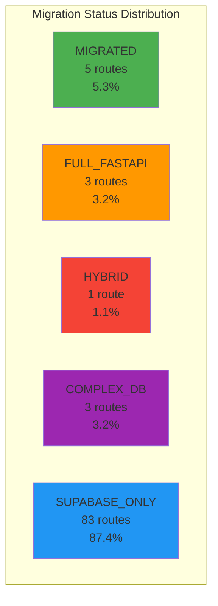
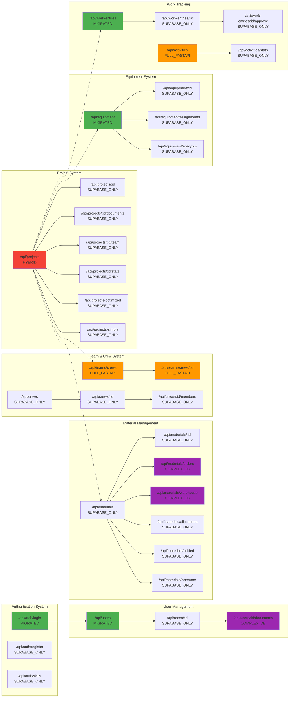
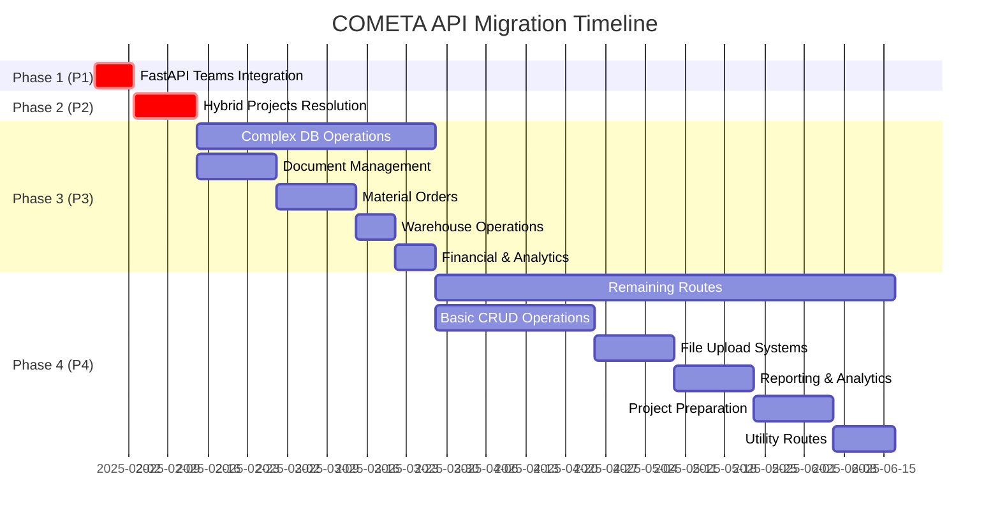
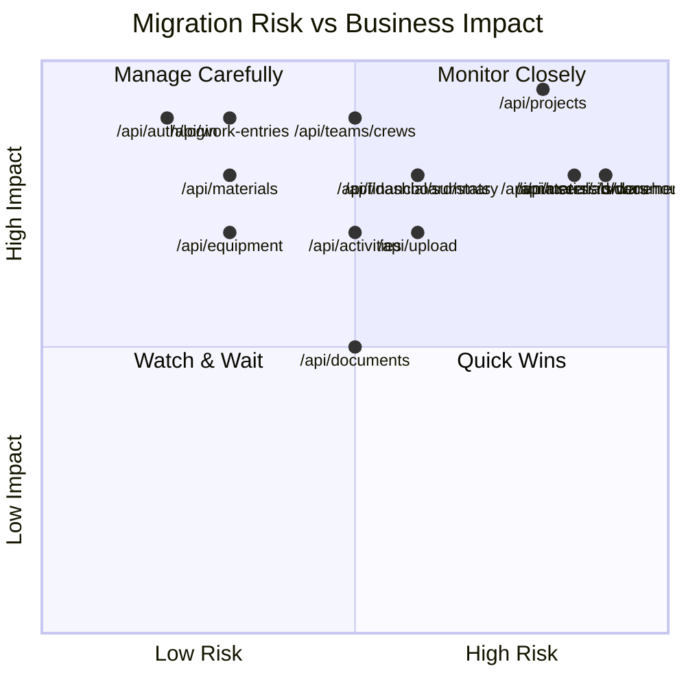

# COMETA API Routes Migration Dependency Diagram

## Migration Status Overview

## Critical Path Migration Dependencies

```mermaid
graph TD
    %% Phase 1: Critical P1 Routes (FastAPI Integration)
    subgraph "Phase 1: P1 Critical Routes"
        A1["/api/teams/crews<br/>FULL_FASTAPI<br/>8h"]
        A2["/api/teams/crews/:id<br/>FULL_FASTAPI<br/>8h"]
        A3["/api/activities<br/>FULL_FASTAPI<br/>8h"]
    end

    %% Phase 2: P2 Hybrid Resolution
    subgraph "Phase 2: P2 Hybrid Resolution"
        B1["/api/projects<br/>HYBRID<br/>12h"]
    end

    %% Phase 3: P3 Complex Operations
    subgraph "Phase 3: P3 Complex Operations"
        C1["/api/users/:id/documents<br/>COMPLEX_DB<br/>16h"]
        C2["/api/materials/orders<br/>COMPLEX_DB<br/>14h"]
        C3["/api/materials/warehouse<br/>COMPLEX_DB<br/>12h"]
        C4["/api/vehicles/assignments<br/>SUPABASE_ONLY<br/>10h"]
        C5["/api/resources/project/:id<br/>SUPABASE_ONLY<br/>10h"]
        C6["/api/financial/summary<br/>SUPABASE_ONLY<br/>10h"]
        C7["/api/dashboard/stats<br/>SUPABASE_ONLY<br/>12h"]
        C8["/api/resources/unified-assignments<br/>SUPABASE_ONLY<br/>10h"]
        C9["/api/project-readiness/:id/checklist<br/>SUPABASE_ONLY<br/>10h"]
    end

    %% Dependencies
    A1 --> A2
    A3 --> |"activities stats"| D1["/api/activities/stats"]

    B1 --> |"project details"| D2["/api/projects/:id"]
    B1 --> |"project documents"| D3["/api/projects/:id/documents"]
    B1 --> |"project team"| D4["/api/projects/:id/team"]
    B1 --> |"project stats"| D5["/api/projects/:id/stats"]

    C1 --> |"documents"| D6["/api/documents"]
    C1 --> |"file upload"| D7["/api/upload"]

    C2 --> |"order details"| D8["/api/materials/orders/:id"]
    C2 --> |"budget management"| D9["/api/materials/orders/:id/budget"]
    C2 --> |"suppliers"| D10["/api/suppliers"]

    C3 --> |"materials"| D11["/api/materials"]
    C3 --> |"low stock"| D12["/api/materials/low-stock"]

    C4 --> |"vehicles"| D13["/api/vehicles"]
    C4 --> |"vehicle resources"| D14["/api/resources/vehicle-assignments"]

    style A1 fill:#FF9800
    style A2 fill:#FF9800
    style A3 fill:#FF9800
    style B1 fill:#F44336
    style C1 fill:#9C27B0
    style C2 fill:#9C27B0
    style C3 fill:#9C27B0
```

## Core System Dependencies

## Migration Priority Timeline

## Risk Assessment Matrix

## Summary Statistics

- **Total Routes**: 95
- **Migrated**: 5 (5.3%) - ✅ Complete
- **FastAPI Integration**: 3 (3.2%) - 🔄 In Progress
- **Hybrid Issues**: 1 (1.1%) - ⚠️ Needs Resolution
- **Complex DB**: 3 (3.2%) - 🔴 High Risk
- **Standard Migration**: 83 (87.4%) - 📋 Planned

**Total Estimated Effort**: 796 hours (≈20 weeks with 2 developers)
**Critical Path**: 132 hours (≈3.5 weeks)

**Key Risks**:
- Complex database operations in COMPLEX_DB routes
- File upload and storage dependencies
- Authentication and permission systems
- Inter-service dependencies

**Recommended Approach**:
1. **Phase 1**: Complete FastAPI integration for critical team management
2. **Phase 2**: Resolve hybrid implementation patterns
3. **Phase 3**: Tackle complex database operations with careful testing
4. **Phase 4**: Systematic migration of remaining standard routes